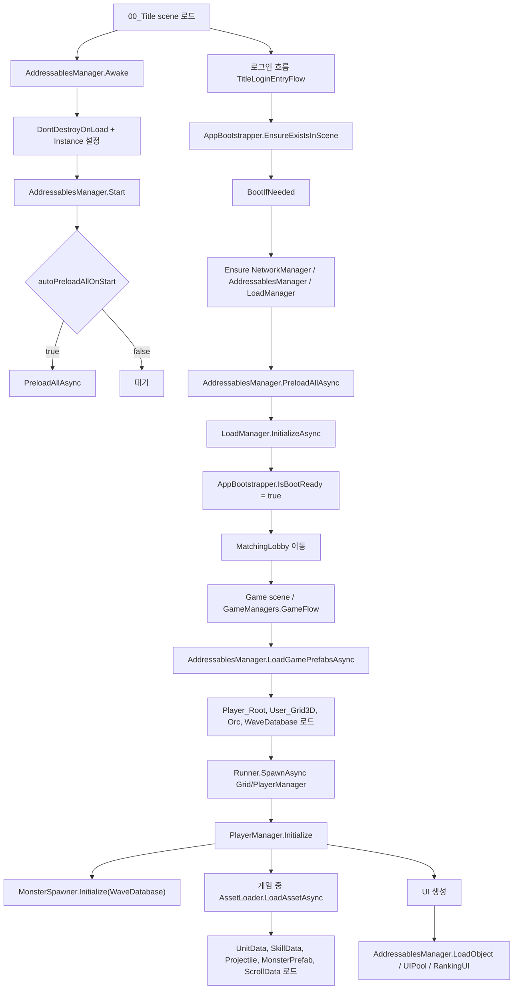
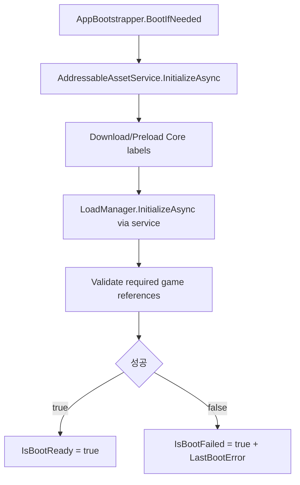

# ReAddressablePlan

작성일: 2026-05-07  
대상 프로젝트: `Mdfproject` / Unity `2021.3.45f1` / Addressables `1.19.19`

## 1. 목적

현재 프로젝트의 Addressables 사용 구조를 분석하고, `AddressablesManager` 중심의 로딩 흐름, 실제 호출 지점, 사용 방법, 개선 및 최적화 방향을 정리한다.

이 문서는 코드 수정 계획서이기도 하다. 현재 요청 범위는 문서 작성이므로 코드 변경은 하지 않았고, 아래 개선 항목은 이후 리팩터링 시 적용할 순서로 정리했다.

참고: 일부 C# 파일의 한국어 주석/로그 문자열이 mojibake 형태로 깨져 있다. 깨진 주석은 주변 코드 동작 기준으로 의미를 해석했다.

## 2. 현재 구조 요약

현재 Addressables 사용은 하나의 통합 서비스로 모여 있지 않고, 다음 흐름들이 병렬로 존재한다.

| 구분 | 파일 | 역할 |
| --- | --- | --- |
| 부트 선로딩 | `Assets/Scripts/Managers/AddressablesManager.cs` | 전역 싱글톤, 전체 Addressables 사전 로드, 게임 핵심 프리팹 캐싱, UI 프리팹 인스턴스 생성 |
| 앱 부트스트랩 | `Assets/Scripts/Bootstrap/AppBootstrapper.cs` | Title 진입 시 매니저 존재 확인 후 `PreloadAllAsync`, `LoadManager.InitializeAsync` 호출 |
| 범용 키 로더 | `Assets/Scripts/Managers/AssetLoader.cs` | string key 기반 제네릭 로드 및 단순 asset cache |
| UnitData 로더 | `Assets/Scripts/Managers/LoadManager.cs` | Inspector 목록 또는 `UnitData` label 기반 UnitData 목록 캐싱 |
| 정적 자산 레지스트리 | `Assets/Scripts/ComponentRegistrySystem/StaticAssets/AddressableAssetLoader.cs` | 일부 Tile/Sprite 하드코딩 로드 후 `AssetRegistry`에 등록 |
| 정적 자산 캐시 | `Assets/Scripts/ComponentRegistrySystem/StaticAssets/AssetRegistry.cs` | Tile/Sprite/Prefab/Sound 딕셔너리 저장소 |
| 인스펙터 키 선택 | `Assets/Scripts/DB/AddressableKeyAttribute.cs` | string 필드에 Addressable key 용도를 표시 |
| 인스펙터 Drawer | `Assets/Scripts/Editor/AddressableKeyDrawer.cs` | Addressable로 등록된 asset을 ObjectField로 선택하면 address string 저장 |
| 데이터 임포트 | `Assets/Scripts/Editor/GoogleSheetDataImporter.cs` | Google Sheet의 `;` 구분 string key를 UnitData 필드에 저장 |

핵심 문제는 로더가 여러 개라는 점이다. `AddressablesManager`, `AssetLoader`, `LoadManager`, `AugmentManager`, `ShopSlot`, `AssetRegistry`가 각각 직접 `Addressables.*` API를 호출한다. 그 결과 handle 수명 관리, 캐시 정책, 실패 처리, 선로딩 기준이 통일되어 있지 않다.

## 3. Addressables 설정 현황

### 3.1 패키지와 기본 설정

- `Packages/manifest.json` 기준 Addressables 버전은 `com.unity.addressables: 1.19.19`.
- `AddressableAssetSettings.asset` 기준:
  - `m_BuildRemoteCatalog: 1`
  - `m_OptimizeCatalogSize: 0`
  - `m_UniqueBundleIds: 1`
  - `m_NonRecursiveBuilding: 1`
  - `m_maxConcurrentWebRequests: 500`
  - `m_ActivePlayerDataBuilderIndex: 3`
- label table에는 `UI`, `Augment`, `CharacterPrefab`, `MonsterData`, `SkillData`, `UnitData`, `Projectile`, `Manager`, `MonsterPrepab`, `WaveData`, `UnitPortrait`, `Scroll` 등이 있다.

주의할 점:

- `MonsterPrepab` label은 오타로 보인다. 의도는 `MonsterPrefab`일 가능성이 높다.
- `Default Local Group` 이름과 달리 schema의 BuildPath/LoadPath가 Remote profile id를 참조한다.
- `Packed Assets` 그룹은 존재하지만 entry가 비어 있다.

### 3.2 Default Local Group 구성

`Assets/AddressableAssetsData/AssetGroups/Default Local Group.asset`에는 현재 99개 entry가 있다.

주요 label 분포:

| Label | 개수 |
| --- | ---: |
| UI | 19 |
| Augment | 13 |
| MonsterData | 12 |
| MonsterPrepab | 12 |
| SkillData | 11 |
| UnitData | 7 |
| CharacterPrefab | 7 |
| Scroll | 7 |
| Manager | 4 |
| WallPrefab | 2 |
| Projectile | 2 |
| UnitPortrait | 2 |
| MonsterPortrait | 1 |
| WaveData | 1 |

대표 address:

- Manager: `GameManagers`, `User_Grid3D`, `Player_Root`, `UIManager`
- Wave: `WaveDatabase`
- UnitData: `UnitData_Warrior`, `UnitData_Archer`, `UnitData_Mage`, `UnitData_Assassin`, `UnitData_Guardian`, `UnitData_Cleric`, `UnitData_Pyromancer`
- MonsterData: `MonData_Orc`, `MonData_Slime`, `MonData_Bat`, `MonData_Boss_Dragon` 등
- Monster prefab: `Orc`, `Slime`, `Spider`, `Skeleton`, `Boss_Dragon`, `Boss_Reaper` 등
- UI: `UI_Pnl_Shop`, `UI_Pnl_Augment`, `UI_Pnl_PlayerRanking`, `UI_Slot_PlayerRank`, `UI_Pnl_AttackSequence` 등

### 3.3 번들 구성상 위험

`Default Local Group_BundledAssetGroupSchema.asset`의 `m_BundleMode: 0`은 Addressables 1.19.19 기준 `PackTogether`이다.

즉 현재 설정은 Default Local Group의 비-scene entry들이 큰 단일 번들로 묶일 가능성이 높다. 이 상태에서 `PreloadAllAsync`가 모든 location을 로드하면 UI, UnitData, MonsterData, 몬스터 프리팹, 매니저 프리팹, 스크롤, 스킬 데이터 등이 시작 시점에 한 번에 메모리에 올라올 수 있다.

## 4. 씬 배치 현황

`Assets/Scenes/00_Title.unity`에서 확인한 내용:

- `AddressablesManager` 오브젝트가 존재한다.
- `autoPreloadAllOnStart: 1`
- `logPreloadProgress: 1`
- serialized `AssetReference`:
  - `playerManagerPrefabRef` -> `Player_Root`
  - `gridPrefabRef` -> `User_Grid3D`
  - `defaultMonsterPrefabRef` -> `Orc`
  - `waveDatabaseRef` -> `WaveDatabase`
- `LoadManager` 오브젝트가 존재한다.
- `LoadManager.inspectorUnitData`에 7개 UnitData가 직접 연결되어 있다.
- `NetworkManager` 오브젝트가 존재한다.

주의할 점:

- 실제 씬 파일명은 `00_Title.unity`이다.
- `SceneDefine.Title`은 `"Title"`로 정의되어 있다.
- `AppBootstrapper.OnSceneLoaded`는 `scene.name != SceneDefine.Title`이면 아무것도 하지 않는다.
- Unity의 `scene.name`은 일반적으로 씬 asset 파일명 기준이므로, 현재 파일명 그대로라면 `00_Title`과 `Title`이 불일치할 수 있다.
- 다만 로그인 흐름의 `TitleLoginEntryFlow`가 `AppBootstrapper.EnsureExistsInScene()`을 직접 호출하므로, 로그인 경로에서는 부트스트랩이 별도로 트리거된다.

## 5. 전체 런타임 흐름



## 6. `AddressablesManager` 상세 분석

### 6.1 상태와 serialized field

`AddressablesManager`는 `MonoBehaviour` 싱글톤이다.

주요 inspector 값:

- `autoPreloadAllOnStart`: Start에서 전체 선로딩을 자동 실행할지 결정한다.
- `logPreloadProgress`: 선로딩 로그 출력 여부.
- `playerManagerPrefabRef`: `Player_Root`
- `gridPrefabRef`: `User_Grid3D`
- `defaultMonsterPrefabRef`: `Orc`
- `waveDatabaseRef`: `WaveDatabase`

공개 상태:

- `AssetsReady`: `PreloadAllAsync` 성공 또는 로드 대상 없음일 때 true.
- `IsPreloading`: `PreloadAllAsync` 실행 중 true.
- `GamePrefabsLoaded`: `LoadGamePrefabsAsync` 완료 후 true.

캐시된 asset:

- `PlayerManagerPrefab`
- `GridPrefab`
- `DefaultMonsterPrefab`
- `WaveDatabase`

### 6.2 Awake / Start

흐름:

1. `Awake`에서 `Instance`가 없으면 자신을 singleton으로 등록한다.
2. `DontDestroyOnLoad(gameObject)`로 씬 이동 후에도 유지한다.
3. 중복 인스턴스는 `Destroy(gameObject)`로 제거한다.
4. `Start`에서 `autoPreloadAllOnStart`가 true면 `PreloadAllAsync()`를 await한다.

주의할 점:

- `Start`가 `async void`이다. 예외가 상위 호출자에게 전달되지 않는다.
- `AppBootstrapper`도 `PreloadAllAsync()`를 호출하므로 자동 선로딩과 부트스트랩 선로딩이 동시에 발생할 수 있다.
- 중복 호출 자체는 `IsPreloading`으로 대기 처리되지만, 대기한 호출자는 첫 호출 성공/실패를 확인하지 않고 return한다.

### 6.3 PreloadAllAsync

현재 목적:

- Addressables 초기화 후 모든 ResourceLocator key를 훑어서 `UnityEngine.Object`로 locate 가능한 모든 location을 모은다.
- 중복 location을 제거한다.
- `Addressables.LoadAssetsAsync<Object>(locations, null)`로 모든 asset을 로드한다.
- 성공하면 `AssetsReady = true`, `_preloadCompleted = true`.

세부 흐름:

1. `_preloadCompleted`가 true면 `AssetsReady = true` 후 return.
2. `IsPreloading`이 true면 `UniTask.WaitUntil(() => !IsPreloading)`로 기다린 뒤 return.
3. `Addressables.InitializeAsync()` 실행.
4. `CollectAllObjectLocations()` 실행.
5. location이 0개면 warning 후 ready 처리.
6. 모든 location을 `LoadAssetsAsync<Object>`로 로드.
7. handle status가 `Succeeded`이면 ready 처리.
8. 실패하면 error log만 남긴다.
9. finally에서 `IsPreloading = false`.

현재 장점:

- 이후 같은 asset을 로드할 때 Addressables 내부 캐시/번들 캐시 덕분에 지연이 줄어들 수 있다.
- resource locator를 직접 순회하므로 label이 누락된 asset도 발견할 수 있다.

현재 위험:

- 모든 Addressable asset을 시작 시점에 로드한다. asset 수와 번들 크기가 커질수록 초기 부팅 시간이 길어지고 메모리 사용량이 급증한다.
- Default Local Group이 `PackTogether`라면 작은 asset 하나를 원해도 큰 번들을 통째로 받거나 로드할 수 있다.
- `LoadAssetsAsync<Object>` 결과를 실제로 사용하지 않고 warming 용도로만 유지한다.
- `_preloadHandle`을 release하지 않는다. 전체 사전 로드 asset은 앱 종료까지 메모리에 남는 구조다.
- 실패 시 예외를 던지지 않고 log만 남긴다. `AppBootstrapper`는 실패를 감지하지 못하고 부팅 성공으로 진행할 수 있다.
- `IsPreloading` 중 대기한 호출자는 첫 호출 결과를 확인하지 않는다.
- `CollectAllObjectLocations`가 `Debug.unityLogger.logEnabled`를 전역으로 껐다 켠다. 이 순간 다른 시스템 로그도 같이 사라질 수 있다.
- 현재 파일에는 깨진 문자열 때문에 컴파일을 막을 가능성이 있는 로그 라인이 보인다. 예: `PreloadAll 완료` 로그의 closing quote가 깨져 있다.

### 6.4 CollectAllObjectLocations

동작:

- `Addressables.ResourceLocators`를 순회한다.
- 각 locator의 모든 key를 대상으로 `locator.Locate(key, typeof(Object), out locations)` 호출.
- `location.ResourceType`이 `UnityEngine.Object`에 할당 가능하지 않으면 제외한다.
- `InternalId` 또는 `PrimaryKey`로 중복 제거한다.

좋은 점:

- GUID, address, label 등 어떤 key로 걸려 있어도 실제 location을 찾는다.
- 같은 내부 asset을 여러 key가 가리켜도 중복 로드를 줄인다.

문제점:

- 의도한 lifecycle 기준이 없다. `Preload` label만 로드하는 것이 아니라 catalog에 잡힌 거의 모든 Object를 대상으로 한다.
- locator key 순회 과정에서 Addressables 내부/Localization/Built In Data까지 섞일 수 있다.
- missing script warning 회피를 위해 global logger를 끄는 방식은 부작용이 있다.

### 6.5 LoadGamePrefabsAsync

목적:

- 실제 게임 시작에 필요한 핵심 프리팹과 `WaveDatabase`를 로드해서 manager field에 캐싱한다.

로드 대상:

- `Player_Root` -> `PlayerManagerPrefab`
- `User_Grid3D` -> `GridPrefab`
- `Orc` -> `DefaultMonsterPrefab`
- `WaveDatabase` -> `WaveDatabase`

흐름:

1. `GamePrefabsLoaded`가 true면 return.
2. 각 `AssetReference.RuntimeKeyIsValid()` 확인.
3. valid reference만 `LoadPrefabAsync` 또는 `LoadWaveDatabaseAsync` task에 추가.
4. `UniTask.WhenAll(loadTasks)`로 병렬 로드.
5. 완료 후 `GamePrefabsLoaded = true`.

문제점:

- 필수 reference가 invalid여도 실패로 처리하지 않는다.
- 개별 load 실패 시 log만 남기고 전체 결과는 성공처럼 `GamePrefabsLoaded = true`가 된다.
- `AssetReference.LoadAssetAsync` handle을 로컬 변수로만 보관하고 release하지 않는다.
- `defaultMonsterPrefabRef`로 로드한 `DefaultMonsterPrefab`은 현재 검색 범위에서는 실사용처가 거의 없다. 필요하지 않다면 선로딩에서 제외할 수 있다.

### 6.6 LoadObject

목적:

- string address로 `GameObject` prefab을 로드하고 즉시 `Instantiate`한다.

사용처:

- `RankingUIController`: `UI_Slot_PlayerRank`
- `UIPool`: addressable key 기반 UI 생성

흐름:

1. `Addressables.LoadAssetAsync<GameObject>(name)` 실행.
2. 성공하면 `Instantiate(prefabAsset, parent)`.
3. 실패하면 null 반환.

문제점:

- 매번 `LoadAssetAsync` handle을 생성하지만 handle을 저장하거나 release하지 않는다.
- Addressables의 instance tracking을 쓰지 않고 일반 `Object.Instantiate`를 사용한다.
- UI 풀에서 반환한 GameObject를 비활성화할 뿐, Addressables handle과 연결된 unload 정책이 없다.
- prefab asset caching은 Addressables 내부에 의존하고, 프로젝트 레벨의 명시적 ref-count가 없다.

## 7. 주변 로더 상세 분석

### 7.1 AppBootstrapper

역할:

- Title scene에서 boot singleton을 보장한다.
- `NetworkManager`, `AddressablesManager`, `LoadManager`를 찾거나 활성화한다.
- `AddressablesManager.Instance.PreloadAllAsync()` 이후 `LoadManager.Instance.InitializeAsync()`를 호출한다.
- 성공하면 `IsBootReady = true`.

현재 흐름상 중요 지점:

- `TitleLoginEntryFlow.TryLoginAndMoveToMatchingLobby`가 로그인 전에 `AppBootstrapper.EnsureExistsInScene()`을 호출한다.
- 로그인은 `AppBootstrapper.IsBootReady`가 false면 바로 실패/대기 메시지를 남긴다.

문제점:

- `BootstrapDefine.AddressablesPreloadTimeoutMs`, `LoadManagerInitTimeoutMs`가 정의되어 있지만 실제 boot 흐름에서 사용되지 않는다.
- `PreloadAllAsync`가 실패를 throw하지 않으면 boot 실패로 이어지지 않는다.
- `SceneDefine.Title = "Title"`과 실제 씬 파일 `00_Title.unity`가 맞지 않을 수 있다.

### 7.2 AssetLoader

역할:

- string key로 `Addressables.LoadAssetAsync<T>` 실행.
- `_assetCache: Dictionary<string, object>`에 성공 결과 저장.
- 이후 같은 key 요청은 cache에서 즉시 반환.

사용처:

- `RegisterUnitAtCommand`: UnitData
- `Monster`: MonsterData
- `MonsterSpawner`: monster prefab
- `Unit`: SkillData, projectile prefab
- `FieldManager`: wall/unit/skill 관련 prefab 및 SkillData
- `GameManagers`: MagicScrollData
- `ShopManager`: UnitData
- `MonsterSlotUI`: monster icon Sprite
- `StatusBarUI`, `UnitDetailPanelController`, `ProjectileVfxManager` 등

문제점:

- handle을 저장하지 않는다. 따라서 `Addressables.Release(handle)`을 호출할 수 없다.
- cache clear는 dictionary만 비우고 Addressables ref-count를 줄이지 않는다.
- 같은 key가 동시에 여러 곳에서 요청되면 첫 요청 완료 전까지 중복 load가 발생할 수 있다.
- cache key가 string 하나뿐이다. 같은 key를 서로 다른 타입으로 요청하면 잘못된 cast/null이 발생할 수 있다.
- 실패한 key에 대한 negative cache나 진단 정보가 없다.

### 7.3 LoadManager

역할:

- UnitData 목록을 준비한다.
- Inspector에 UnitData가 있으면 그것을 우선 사용한다.
- Inspector 목록이 비어 있으면 `Addressables.LoadAssetsAsync<UnitData>("UnitData", null)`로 label 로드한다.
- `_unitByKey`는 `UnitData.name` 기준으로 구성한다.

현재 씬 상태:

- `00_Title.unity`의 `LoadManager.inspectorUnitData`에는 7개 UnitData가 직접 연결되어 있다.
- 따라서 현재 기본 흐름에서는 Addressables label `UnitData`를 타지 않을 가능성이 높다.

주의할 점:

- Addressables address와 `UnitData.name`이 다르면 `GetUnitData(key)` 조회가 실패할 수 있다.
- handle release가 없다.
- Inspector 직접 참조와 Addressables 로딩이 혼재되어 배포 빌드 기준 정책이 불명확하다.

### 7.4 AddressableAssetLoader / AssetRegistry

역할:

- `AddressableAssetLoader.Start`에서 `LoadAllAssets()` 실행.
- 현재 하드코딩으로 `BreakWall` tile과 `Spr_Port_Warrior` sprite를 로드해서 `AssetRegistry`에 등록한다.
- `AssetRegistry`는 TileBase, Sprite, GameObject, AudioClip 딕셔너리를 가진다.

현재 상태:

- `tileBaseList`가 있지만 실제 반복 사용되지 않는다.
- TODO로 sprite/prefab/sound 확장이 남아 있다.
- scene/prefab 검색 결과 `AddressableAssetLoader`가 현재 씬에 배치된 흔적은 보이지 않았다.

판단:

- 현재 핵심 Addressables 런타임 경로라기보다 과거/실험용 정적 자산 로더에 가깝다.
- 유지할 것이라면 통합 서비스 아래로 흡수하고, 사용하지 않는다면 제거 후보로 분류하는 것이 좋다.

### 7.5 Direct Addressables 호출

통합되지 않은 직접 호출:

- `AugmentManager.LoadAllAugmentsAsync`: `Addressables.LoadAssetsAsync<AugmentData>("Augment", null)`
- `ShopSlot.DisplayUnit`: icon sprite를 직접 `Addressables.LoadAssetAsync<Sprite>`로 로드하고 이전 handle 및 OnDestroy에서 release
- `LoadManager.InitializeAsync`: UnitData label 직접 로드
- `AssetRegistry`: Tile/Sprite 직접 로드

`ShopSlot`은 release를 직접 처리하고 있어 상대적으로 안전하지만, 정책이 개별 UI 컴포넌트에 흩어져 있다.

## 8. 데이터 기반 Addressable key 흐름

### 8.1 ScriptableObject 필드

`UnitData`:

- `unitIcon`: `Sprite` address
- `prefabsByStarLevel`: 1/2/3성 unit prefab address
- `skillsByStarLevel`: 1/2/3성 SkillData address
- `projectilePrefabsByStarLevel`: projectile prefab address

`MonsterData`:

- `monsterIcon`: `Sprite` address
- `monsterPrefab`: monster prefab address
- `projectilePrefab`: projectile prefab address

이 필드들은 `[AddressableKey(typeof(...))]`를 사용한다. Editor에서는 `AddressableKeyDrawer`가 object를 drag/drop하면 해당 asset의 Addressables address를 string에 저장한다.

### 8.2 GoogleSheet importer

`GoogleSheetDataImporter`는 UnitData import 시 다음 값을 string 또는 string array로 저장한다.

- `unitIcon`
- `prefabsByStarLevel`
- `skillsByStarLevel`
- `projectilePrefabsByStarLevel`

배열은 `;` 구분자로 split한다. 이 값들은 실제 Addressable address와 정확히 일치해야 한다.

현재 importer의 `GetAssetArrayFromSheet`는 남아 있지만 실제 `ImportAllData`에서는 string key 배열을 사용하는 구조다.

## 9. 실제 사용 방법

### 9.1 새 asset을 Addressable로 등록하는 방법

1. Unity Editor에서 asset 또는 prefab을 선택한다.
2. Inspector의 Addressable 체크를 켠다.
3. address를 코드/데이터에서 사용할 key로 맞춘다.
   - 예: `UnitData_Warrior`, `Skill_Heal`, `UI_Pnl_Shop`
4. lifecycle에 맞는 label을 붙인다.
   - Unit data: `UnitData`
   - Skill data: `SkillData`
   - UI prefab: `UI`
   - Monster data: `MonsterData`
   - Monster prefab: 현재는 `MonsterPrepab`, 개선 후 `MonsterPrefab`
   - Core manager prefab: `Manager`
   - Wave database: `WaveData`
5. `UnitData`, `MonsterData`의 `[AddressableKey]` string 필드는 직접 문자열을 입력하기보다 Inspector ObjectField로 asset을 선택해 address가 자동 저장되도록 한다.

### 9.2 게임 핵심 프리팹 교체 방법

`00_Title.unity`의 `AddressablesManager` 오브젝트에서 아래 `AssetReference`를 교체한다.

- `playerManagerPrefabRef`: player root prefab
- `gridPrefabRef`: grid prefab
- `defaultMonsterPrefabRef`: 기본 몬스터 prefab
- `waveDatabaseRef`: WaveDatabase ScriptableObject

교체 asset은 반드시 Addressable로 등록되어 있어야 하고, 타입이 맞아야 한다. 현재 field 타입은 raw `AssetReference`라서 잘못된 타입을 넣어도 컴파일 단계에서 막히지 않는다.

### 9.3 부트 시점에서 준비 보장

현재 기본 경로:

```csharp
AppBootstrapper.EnsureExistsInScene();

if (!AppBootstrapper.IsBootReady)
{
    return;
}
```

`AppBootstrapper`는 내부적으로 다음을 실행한다.

```csharp
await AddressablesManager.Instance.PreloadAllAsync();
await LoadManager.Instance.InitializeAsync();
```

주의:

- 현재 `AddressablesManager.Start`도 자동 선로딩을 실행한다.
- boot 성공 여부를 정확히 보장하려면 `PreloadAllAsync`가 실패 시 throw 또는 result 반환을 하도록 개선하는 것이 좋다.

### 9.4 key로 asset만 로드하는 방법

현재 코드 기준 권장 사용:

```csharp
UnitData data = await AssetLoader.LoadAssetAsync<UnitData>("UnitData_Warrior");
SkillData skill = await AssetLoader.LoadAssetAsync<SkillData>("Skill_Heal");
GameObject prefab = await AssetLoader.LoadAssetAsync<GameObject>("Warrior");
```

장점:

- 같은 key는 `_assetCache`에 저장되어 다음 요청이 빠르다.

주의:

- 현재 `AssetLoader`는 handle을 release하지 않는다.
- 장시간 유지할 asset cache로만 사용하는 것이 안전하다.
- scene 전환마다 unload해야 하는 asset에는 현재 구조가 맞지 않는다.

### 9.5 UI prefab을 생성하는 방법

현재 `AddressablesManager.LoadObject` 사용:

```csharp
GameObject panel = await AddressablesManager.Instance.LoadObject("UI_Pnl_Shop", parent);
```

`UIPool` 사용:

```csharp
var pool = new UIPool(null, "UI_Slot_PlayerRank");
GameObject slot = await pool.GetObject(parent);
pool.ReturnObject();
```

주의:

- `LoadObject`는 prefab handle을 release하지 않는다.
- 반복 생성 UI는 가능하면 `UIPool` 또는 별도 pool을 사용한다.
- 이후 개선 시 `Addressables.InstantiateAsync`와 `Addressables.ReleaseInstance` 기반으로 바꾸거나, prefab load handle을 서비스가 ref-count로 관리해야 한다.

### 9.6 label로 여러 asset 로드하는 방법

현재 예시:

```csharp
var handle = Addressables.LoadAssetsAsync<AugmentData>("Augment", null);
await handle.Task;
```

개선 전까지 직접 호출을 유지한다면:

- handle을 field에 보관한다.
- 해당 manager가 파괴되거나 data를 unload할 때 `Addressables.Release(handle)`을 호출한다.
- 실패 시 `handle.Status`와 `handle.OperationException`을 확인한다.

## 10. 현재 리스크와 개선 우선순위

### P0 - 바로 확인해야 할 문제

1. 깨진 문자열로 인한 컴파일 위험 수정
   - `AddressablesManager.cs`의 `PreloadAll 완료` 로그 라인에 closing quote가 깨져 보인다.
   - `AssetRegistry.cs`, `ShopSlot.cs`, `UnitData.cs` 등에도 mojibake가 광범위하다.
   - 우선 C# syntax error가 있는 파일을 전부 찾아 UTF-8 기준으로 복구해야 한다.

2. boot 성공 판정 보강
   - `PreloadAllAsync` 실패가 `AppBootstrapper` 실패로 전파되지 않는다.
   - `LoadGamePrefabsAsync`는 일부 필수 asset 로드 실패 후에도 `GamePrefabsLoaded = true`가 될 수 있다.
   - 핵심 asset은 실패 시 명시적으로 throw하거나 `AddressablesLoadResult` 같은 결과 객체를 반환해야 한다.

3. `SceneDefine.Title`과 실제 scene 이름 확인
   - 현재 scene 파일은 `00_Title.unity`, 상수는 `"Title"`이다.
   - scene hook 기반 boot가 필요한 경우 이름 불일치로 동작하지 않을 수 있다.
   - 해결책은 scene 파일명 변경, `SceneDefine.Title = "00_Title"` 변경, 또는 build index/path 기반 판정 중 하나다.

4. 전체 선로딩 범위 축소
   - 현재 `CollectAllObjectLocations`는 모든 ResourceLocator key를 순회한다.
   - 시작 시점에는 `Preload` label 또는 `Core` label만 대상으로 삼아야 한다.
   - 현재 label table에 `Preload`가 있지만 Default Local Group 게임 asset에는 거의 적용되어 있지 않다.

### P1 - 구조 개선

1. 로더 통합
   - `AddressablesManager`, `AssetLoader`, `LoadManager`, `AssetRegistry`, direct `Addressables.*` 호출을 하나의 `AddressableAssetService` 또는 개선된 `AddressablesManager`로 합친다.
   - 기능은 `LoadAsync<T>`, `LoadLabelAsync<T>`, `InstantiateAsync`, `Release`, `ReleaseInstance`, `PreloadLabelsAsync`로 나눈다.

2. handle/ref-count 관리
   - cache에는 asset object만 저장하지 말고 `AsyncOperationHandle`, type, refCount, lastAccessTime, in-flight task를 함께 저장한다.
   - cache clear 시 `Addressables.Release(handle)`을 호출한다.
   - scene/lifecycle 단위 scope를 두어 Game scene 종료 시 UI/전투 asset을 정리할 수 있게 한다.

3. 중복 동시 로드 방지
   - 현재 `AssetLoader`는 완료 후 cache만 한다.
   - 같은 key가 같은 frame에 여러 번 요청되면 중복 request가 생길 수 있다.
   - `_inFlightLoads[(typeof(T), key)] = UniTask<T>` 형태로 진행 중 요청을 공유한다.

4. typed AssetReference 적용
   - `AssetReference` 대신 `AssetReferenceGameObject`, `AssetReferenceT<WaveDatabase>` 또는 custom typed reference를 사용한다.
   - 잘못된 타입 assignment를 editor 단계에서 줄인다.

5. key 상수 자동 생성
   - 현재 `AssetKeys.cs`는 거의 비어 있다.
   - Addressables settings에서 address/label을 읽어 `AssetKeys.Generated.cs`를 생성하면 typo를 줄일 수 있다.
   - GoogleSheet import 시에도 generated key 목록으로 검증한다.

6. label/그룹 정리
   - `MonsterPrepab` -> `MonsterPrefab`으로 정리한다.
   - label은 lifecycle 기준과 타입 기준을 분리한다.
   - 예: `Core`, `Gameplay`, `UI`, `UnitData`, `MonsterData`, `Preload`, `RemoteOptional`.

### P2 - 최적화

1. 그룹 분리
   - 현재 Default Local Group에 거의 모든 게임 asset이 들어 있다.
   - 권장 그룹:
     - `CoreLocal`: `Player_Root`, `User_Grid3D`, `GameManagers`, `WaveDatabase`
     - `GameData`: UnitData, MonsterData, SkillData, ScrollData, AugmentData
     - `UI`: UI prefab
     - `Units`: unit prefab
     - `Monsters`: monster prefab
     - `ProjectilesVFX`: projectile/VFX prefab
     - `Localization`: Unity Localization generated groups 유지
   - 각 그룹의 BuildPath/LoadPath를 명확히 Local/Remote로 분리한다.

2. BundleMode 재검토
   - 현재 `PackTogether`는 작은 변경에도 큰 번들을 다시 받거나 큰 번들을 통째로 로드할 수 있다.
   - 데이터/UI/프리팹은 `PackTogetherByLabel` 또는 lifecycle별 group 분리를 검토한다.
   - 너무 잘게 쪼개면 request 수가 증가하므로, 실제 빌드 리포트로 번들 크기를 확인한다.

3. 선 다운로드와 실제 로드 분리
   - remote 환경에서는 시작 시 asset object를 모두 load하기보다 `DownloadDependenciesAsync(label)`로 번들 다운로드만 끝내는 방식이 더 안전할 수 있다.
   - 실제 object load는 필요한 시점에 수행한다.
   - `GetDownloadSizeAsync`로 다운로드 크기 UI를 표시할 수 있다.

4. UI pooling 정책 통합
   - `UIPool`은 현재 active object 하나만 추적하는 구조다.
   - 여러 동시 slot/panel을 다루려면 active set과 inactive queue를 분리해야 한다.
   - Addressables instance release 정책도 pool dispose 시점과 연결해야 한다.

5. unused/legacy 로더 정리
   - `AddressableAssetLoader.tileBaseList`는 현재 실제 반복 로드에 쓰이지 않는다.
   - `AssetRegistry.LoadFromResources`는 Addressables 이전 fallback으로 보인다.
   - 실제 사용처가 없으면 제거하거나 dev-only fallback으로 분리한다.

## 11. 권장 리팩터링 설계

### 11.1 목표

하나의 Addressables 진입점을 만든다.

```csharp
public interface IAddressableAssetService
{
    UniTask InitializeAsync();
    UniTask PreloadLabelsAsync(params string[] labels);
    UniTask<T> LoadAsync<T>(string key) where T : UnityEngine.Object;
    UniTask<IReadOnlyList<T>> LoadLabelAsync<T>(string label) where T : UnityEngine.Object;
    UniTask<GameObject> InstantiateAsync(string key, Transform parent = null);
    void Release(string key);
    void ReleaseInstance(GameObject instance);
    bool TryGetCached<T>(string key, out T asset) where T : UnityEngine.Object;
}
```

### 11.2 cache entry 예시

```csharp
private sealed class CacheEntry
{
    public string Key;
    public Type AssetType;
    public AsyncOperationHandle Handle;
    public UnityEngine.Object Asset;
    public int RefCount;
    public UniTask<UnityEngine.Object> InFlightTask;
    public bool IsPinned;
}
```

정책:

- `Core` preload asset은 `IsPinned = true`로 앱 종료까지 유지한다.
- scene-local asset은 scene 종료 시 ref-count를 줄이고 0이면 release한다.
- UI pool이 가진 prefab/instance는 pool dispose 시 release한다.

### 11.3 Preload 정책

현재:

```csharp
CollectAllObjectLocations();
Addressables.LoadAssetsAsync<Object>(locations, null);
```

개선:

```csharp
await Addressables.InitializeAsync().Task;
await PreloadLabelsAsync("Core", "Preload");
await LoadLabelAsync<UnitData>("UnitData");
```

선택 사항:

- remote bundle만 먼저 받기:

```csharp
var size = await Addressables.GetDownloadSizeAsync("Core").Task;
if (size > 0)
{
    await Addressables.DownloadDependenciesAsync("Core").Task;
}
```

### 11.4 boot 흐름 개선안



권장 동작:

- `AddressablesManager.Start` 자동 선로딩 제거 또는 비활성화.
- boot 책임은 `AppBootstrapper`로 단일화.
- `BootstrapDefine` timeout 상수를 실제 `CancelAfterSlim` 또는 `TimeoutController`에 연결.
- 실패 시 로그인 버튼/다음 씬 이동을 막고 사용자에게 재시도 가능 상태를 제공.

## 12. 단계별 적용 계획

### Step 1 - 안전성 복구

- 깨진 C# 문자열과 컴파일 오류 가능성 확인.
- `SceneDefine.Title`과 실제 scene 이름 정리.
- `PreloadAllAsync`, `LoadGamePrefabsAsync`가 실패를 반환/전파하도록 수정.
- `GamePrefabsLoaded`는 모든 필수 asset 성공 시에만 true로 설정.

### Step 2 - 선로딩 범위 축소

- `Core` 또는 `Preload` label을 실제 핵심 asset에 부여.
- `CollectAllObjectLocations` 기반 전체 로드를 기본 boot에서 제거.
- `Player_Root`, `User_Grid3D`, `WaveDatabase`, 필수 UI 정도만 boot 단계로 이동.
- 나머지는 label 또는 key 기반 lazy load로 유지.

### Step 3 - handle cache 도입

- `AssetLoader`를 handle-aware cache로 교체.
- 기존 `AssetLoader.LoadAssetAsync<T>` public API는 유지하고 내부만 새 service로 위임하면 호출부 변경 범위를 줄일 수 있다.
- direct `Addressables.LoadAssetAsync` 호출부를 점진적으로 service로 이동.

### Step 4 - 그룹/번들 재구성

- Default Local Group에 몰린 asset을 lifecycle별 그룹으로 분리.
- `Packed Assets` 빈 그룹은 제거하거나 목적에 맞게 사용.
- Local/Remote path를 그룹명과 일치시킨다.
- BundleMode를 group별로 재검토한다.

### Step 5 - 검증 자동화

- Editor validation 메뉴 추가:
  - `UnitData`/`MonsterData` string key가 Addressables settings에 존재하는지 검사.
  - label typo 검사.
  - required core references 검사.
  - duplicate address 검사.
- 빌드 전 validation이 실패하면 Addressables build를 막는다.

## 13. 테스트 체크리스트

### Editor PlayMode

- Title scene 진입 후 boot가 1회만 실행되는지 확인.
- `AddressablesManager.Instance` 중복 생성이 없는지 확인.
- `AppBootstrapper.IsBootReady`가 true가 되기 전 로그인 이동이 막히는지 확인.
- Addressables load 실패 시 `IsBootFailed`와 `LastBootError`가 채워지는지 확인.

### 게임 시작

- `LoadGamePrefabsAsync` 후 `GridPrefab`, `PlayerManagerPrefab`, `WaveDatabase`가 null이 아닌지 확인.
- 서버에서 `Runner.SpawnAsync`가 grid/player를 정상 생성하는지 확인.
- `PlayerManager`가 `MonsterSpawner.Initialize`에 WaveDatabase를 전달하는지 확인.

### 데이터 로드

- `LoadManager.GetUnitData("UnitData_Warrior")`가 성공하는지 확인.
- `UnitData.prefabsByStarLevel`, `skillsByStarLevel`, `projectilePrefabsByStarLevel`의 모든 key가 유효한지 검사.
- `MonsterData.monsterPrefab`, `monsterIcon`, `projectilePrefab` key가 유효한지 검사.

### UI

- `UI_Slot_PlayerRank`가 `AddressablesManager.LoadObject`로 생성되는지 확인.
- `UIPool.ReturnObject` 후 재사용 시 parent와 active 상태가 정상인지 확인.
- ShopSlot icon 교체 시 이전 icon handle release가 유지되는지 확인.

### 메모리/성능

- boot 전후 Memory Profiler snapshot 비교.
- `PreloadAllAsync` 제거 전후 Title boot 시간 비교.
- Addressables Event Viewer로 handle ref-count와 release 누락 확인.
- remote catalog 사용 시 다운로드 크기와 request 수 확인.

## 14. 결론

현재 구조는 "모든 Addressables를 시작 시 한 번 데워두고, 게임 중에는 여러 로더가 필요한 key를 다시 요청하는 방식"에 가깝다. 작은 프로젝트 단계에서는 동작할 수 있지만, asset 수가 늘면 초기 부팅 시간, 메모리 상주량, release 누락, 중복 로드, 실패 은폐 문제가 커진다.

우선순위는 다음이다.

1. 컴파일/부트 실패 감지 문제를 먼저 고친다.
2. 전체 선로딩을 label 기반 핵심 선로딩으로 줄인다.
3. handle-aware 통합 로더를 만든다.
4. 그룹/번들/label을 lifecycle 기준으로 재정리한다.
5. Addressable key validation을 Editor 단계에 넣어 런타임 실패를 줄인다.
