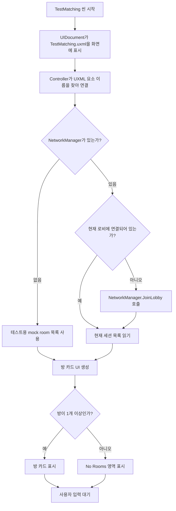
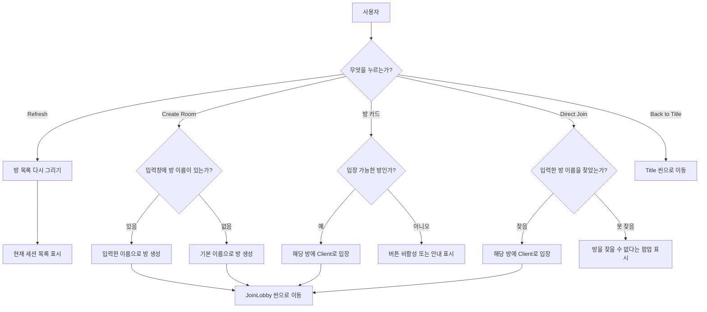
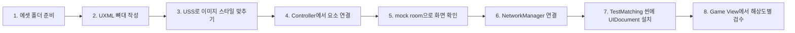

# TestMatching UI Toolkit 구현 계획

## 1. 목표

`TestMatching` 씬에 첨부 이미지처럼 방 목록 화면을 UI Toolkit으로 구현하기 위한 상세 계획이다.

이번 단계의 범위는 **문서 작성만**이다.

- 코드 생성 없음
- UXML 생성 없음
- USS 생성 없음
- 씬 오브젝트 생성 없음
- 에셋 이동 없음

이 문서는 다음 단계에서 실제 구현할 때 따라갈 설계도 역할을 한다.

참고 이미지:

`C:/Users/djthe/Downloads/ChatGPT Image 2026년 5월 1일 오후 06_07_49.png`

확인한 이미지 크기:

- `1672 x 941`
- 거의 `16:9` 비율

## 2. 현재 프로젝트 확인 결과

현재 프로젝트 기준으로 확인된 내용은 다음과 같다.

| 항목 | 현재 상태 |
| --- | --- |
| 대상 씬 | `Mdfproject/Assets/Scenes/TestMatching.unity` |
| 씬 상태 | `Main Camera`, `Directional Light`만 있는 빈 테스트 씬에 가까움 |
| 기존 매칭 UI | `Mdfproject/Assets/Scripts/Network/LobbyUI.cs`가 UGUI 방식으로 존재 |
| 기존 방 아이템 UI | `Mdfproject/Assets/Scripts/Network/RoomItem.cs`가 UGUI 방식으로 존재 |
| 네트워크 매니저 | `Mdfproject/Assets/Scripts/Network/NetworkManager.cs` |
| 기존 UI Toolkit 예시 | `Mdfproject/Assets/UI/ReLogin`, `ReLoginUIToolkitController.cs` |
| 한글 폰트 | `Mdfproject/Assets/Resource/Fonts/NotoSansKR-VariableFont_wght.ttf` |

결론:

- `TestMatching`은 새 UI Toolkit 화면을 테스트하기 좋은 씬이다.
- 기존 `LobbyUI`와 `RoomItem`의 기능 흐름은 재사용하되, 화면 구성은 UI Toolkit 방식으로 새로 만드는 것이 좋다.
- 기존 `ReLogin` UI Toolkit 구현처럼 `UXML + USS + C# Controller + PanelSettings` 구조를 따른다.

## 3. 초보자용 개념 정리

UI Toolkit 구현에서 각 파일과 컴포넌트가 맡는 역할은 다음과 같다.

| 이름 | 쉽게 말하면 | 이번 화면에서 하는 일 |
| --- | --- | --- |
| UXML | UI 뼈대 | 버튼, 방 목록, 입력창, 패널 같은 화면 요소를 배치한다. |
| USS | UI 디자인 | 색상, 크기, 둥근 모서리, 글꼴, 여백, hover/pressed 상태를 꾸민다. |
| C# Controller | UI 조종자 | 버튼 클릭, 방 목록 갱신, 네트워크 연결을 처리한다. |
| UIDocument | 씬에 UI를 띄우는 컴포넌트 | `TestMatching` 씬의 GameObject에 붙어서 UXML을 화면에 보여준다. |
| PanelSettings | UI Toolkit 화면 설정 | 해상도, 정렬, 입력 처리 방식을 관리한다. |
| VisualTreeAsset | UXML 에셋 | C#에서 UXML을 불러오거나 방 아이템 템플릿을 복제할 때 쓴다. |

초보자 기준으로는 이렇게 생각하면 된다.

1. UXML로 화면에 어떤 부품이 있는지 만든다.
2. USS로 그 부품이 어떻게 보일지 정한다.
3. C# Controller로 버튼을 눌렀을 때 무슨 일이 생길지 연결한다.
4. UIDocument를 씬에 넣어 실제 게임 화면에 표시한다.

## 4. 화면 목표

첨부 이미지의 핵심 인상은 다음과 같다.

- 밝은 하늘색 배경
- 왼쪽에는 큰 방 목록 패널
- 오른쪽에는 큰 버튼 3개와 입력창
- 둥근 흰색 카드와 부드러운 회색 그림자
- 파란색, 노란색 버튼으로 주요 행동 구분
- 고양이/캐주얼 게임 느낌의 귀여운 아이콘과 두꺼운 글자

1차 구현에서 맞춰야 할 주요 구성:

- `Room List` 제목
- `Refresh` 버튼
- 방 목록 카드 4개 정도가 들어갈 수 있는 왼쪽 패널
- 방이 없을 때 보이는 `No Rooms` 영역
- `Create Room` 버튼
- `Back to Title` 버튼
- 방 이름 입력창
- `Direct Join` 버튼

## 5. 추천 파일 구조

다음 단계에서 실제 구현할 때 추천하는 파일 구조다.

```text
Mdfproject/
  Assets/
    UI/
      TestMatching/
        TestMatching.uxml
        TestMatchingRoomItem.uxml
        TestMatching.uss
        TestMatchingPanelSettings.asset
    Scripts/
      UI/
        TestMatching/
          TestMatchingUIToolkitController.cs
          Editor/
            TestMatchingUIToolkitSceneInstaller.cs
    Resource/
      Image/
        UI/
          TestMatching/
            bg_test_matching.png
            panel_room_list.png
            panel_room_card.png
            button_create_room.png
            button_direct_join.png
            button_white.png
            input_room_name.png
            icon_refresh.png
            icon_plus.png
            icon_back.png
            icon_people.png
            icon_crown_gold.png
            icon_crown_silver.png
            icon_crown_bronze.png
            icon_trophy.png
            icon_user.png
            icon_room_thumb_forest.png
            icon_room_thumb_farm.png
            icon_room_thumb_candy.png
            icon_room_thumb_beach.png
            empty_chick.png
```

필수 파일:

- `TestMatching.uxml`
- `TestMatchingRoomItem.uxml`
- `TestMatching.uss`
- `TestMatchingUIToolkitController.cs`
- `TestMatchingPanelSettings.asset`

선택 파일:

- `TestMatchingUIToolkitSceneInstaller.cs`
  - Unity 상단 메뉴에서 클릭 한 번으로 `TestMatching` 씬에 UIDocument를 설치하게 만드는 편의용 Editor 스크립트다.
  - 기존 `ReLoginUIToolkitSceneInstaller.cs`와 같은 방식으로 만들면 된다.

## 6. 씬 구성 계획

`TestMatching` 씬에는 다음 오브젝트를 추가하는 방식으로 계획한다.

| GameObject | Component | 역할 |
| --- | --- | --- |
| `TestMatching UI Toolkit` | `UIDocument` | UI Toolkit 화면 표시 |
| `TestMatching UI Toolkit` | `TestMatchingUIToolkitController` | 방 목록과 버튼 동작 제어 |

`UIDocument` 설정:

| 항목 | 값 |
| --- | --- |
| Visual Tree Asset | `Assets/UI/TestMatching/TestMatching.uxml` |
| Panel Settings | `Assets/UI/TestMatching/TestMatchingPanelSettings.asset` |

`TestMatchingUIToolkitController`에서 연결할 주요 값:

| 필드 | 연결 대상 |
| --- | --- |
| `document` | 같은 오브젝트의 `UIDocument` |
| `roomItemTemplate` | `TestMatchingRoomItem.uxml` |
| `titleSceneName` | `SceneDefine.Title` |
| `joinLobbySceneName` | `SceneDefine.JoinLobby` |
| `useMockRoomsInTestScene` | 테스트용으로 `true` 권장 |

## 7. 해상도와 배치 기준

첨부 이미지와 최대한 비슷하게 보이게 하려면, 기준 디자인 공간을 이미지 크기와 동일하게 잡는 것이 좋다.

권장 기준:

- Design Width: `1672`
- Design Height: `941`

구현 방식:

1. UI Toolkit root 안에 `testmatching-design-space`라는 큰 컨테이너를 만든다.
2. 이 컨테이너의 크기를 `1672 x 941`로 고정한다.
3. 실제 화면 크기가 달라지면 C# Controller에서 비율을 계산해 전체 컨테이너를 축소/확대한다.
4. 남는 공간은 배경만 채우고, 핵심 UI 위치는 깨지지 않게 한다.

이 방식은 기존 `ReLoginUIToolkitController`가 쓰는 방식과 비슷하다.

## 8. 주요 좌표 계획

아래 좌표는 첨부 이미지 `1672 x 941` 기준의 대략적인 위치다. 실제 구현 후 Game View 스크린샷을 보면서 2px에서 10px 정도 조정할 수 있다.

| 요소 | x | y | w | h | 설명 |
| --- | ---: | ---: | ---: | ---: | --- |
| 전체 배경 | 0 | 0 | 1672 | 941 | 하늘색 배경 |
| 제목 영역 | 275 | 50 | 360 | 60 | `Room List`와 양쪽 반짝이 |
| Refresh 버튼 | 773 | 51 | 163 | 59 | 제목 오른쪽 |
| 왼쪽 방 목록 패널 | 107 | 127 | 858 | 733 | 반투명 흰색 큰 패널 |
| 방 카드 1 | 134 | 156 | 802 | 113 | 선택/상태 강조 가능 |
| 방 카드 2 | 134 | 280 | 802 | 113 | 일반 카드 |
| 방 카드 3 | 134 | 404 | 802 | 113 | 일반 카드 |
| 방 카드 4 | 134 | 528 | 802 | 113 | 일반 카드 |
| No Rooms 구분선 | 134 | 684 | 802 | 32 | 빈 방 안내 제목 |
| 빈 방 캐릭터 | 360 | 720 | 95 | 100 | 방 없을 때 표시 |
| 빈 방 설명 | 500 | 765 | 220 | 35 | `생성된 방이 없습니다.` |
| Create Room 버튼 | 1100 | 170 | 445 | 130 | 노란색 주요 버튼 |
| Back to Title 버튼 | 1100 | 332 | 445 | 120 | 흰색 보조 버튼 |
| 오른쪽 구분선 | 1100 | 494 | 445 | 2 | 입력 영역과 분리 |
| 방 이름 입력창 | 1096 | 538 | 450 | 78 | `Enter Room Name` |
| Direct Join 버튼 | 1100 | 656 | 445 | 128 | 파란색 주요 버튼 |

## 9. UXML 구조 계획

실제 UXML은 다음과 같은 계층으로 만든다.

```text
testmatching-root
  testmatching-design-space
    background

    header
      sparkle-left
      title-label
      sparkle-right
      refresh-button

    room-list-panel
      room-list-scroll
        room-list-content
          room-item instances
      empty-state
        empty-line-left
        empty-title
        empty-line-right
        empty-character
        empty-message

    right-actions
      create-room-button
        create-icon
        create-label
      back-title-button
        back-icon
        back-label
      room-name-input-wrap
        user-icon
        room-name-field
        room-name-placeholder
      direct-join-button
        people-icon
        direct-join-label

    room-not-found-modal hidden
    network-block-overlay hidden
```

방 카드 템플릿 `TestMatchingRoomItem.uxml` 구조:

```text
room-card
  rank-icon
  room-info
    room-name-label
    room-meta-row
      people-icon
      player-count-label
      divider
      trophy-icon
      rule-label
  room-thumbnail
  status-row
    status-dot
    status-label
```

## 10. USS 디자인 계획

전체 색감:

| 용도 | 색상 방향 |
| --- | --- |
| 배경 | 밝은 하늘색, 아래쪽은 약간 회색/흰색 흐림 |
| 큰 패널 | 흰색 + 낮은 투명도 + 회색 테두리 |
| 방 카드 | 흰색, 둥근 모서리, 약한 그림자 |
| 선택/Playing 카드 | 연두색 테두리 |
| Waiting 상태 | 파란색 점과 파란 글씨 |
| Playing 상태 | 초록색 점과 초록 글씨 |
| Create Room 버튼 | 노랑/주황 계열 |
| Direct Join 버튼 | 파란색 계열 |
| Back 버튼 | 흰색/회색 계열 |

텍스트 방향:

| 텍스트 | 크기 방향 | 특징 |
| --- | --- | --- |
| `Room List` | 매우 큼 | 흰색 글자, 파란 외곽선 느낌 |
| 방 이름 | 큼 | 두껍고 진한 회색 |
| 인원/규칙 | 중간 | 아이콘과 같이 배치 |
| 상태 | 중간 | 색상으로 구분 |
| 버튼 텍스트 | 큼 | 두껍고 외곽선 또는 그림자 느낌 |

UI Toolkit에서 주의할 점:

- CSS처럼 복잡한 그림자가 완벽하게 지원되지 않을 수 있다.
- 고급 그림자와 버튼 광택은 9-slice PNG로 만드는 것이 가장 안정적이다.
- 한글은 반드시 `NotoSansKR` 계열 폰트를 적용한다.
- 이모지 아이콘은 플랫폼마다 다르게 보일 수 있으므로 PNG 아이콘을 권장한다.

## 11. 방 목록 데이터 표시 계획

기존 `NetworkManager`의 세션 목록을 사용한다.

기존 데이터:

| 데이터 | 출처 |
| --- | --- |
| 방 이름 | `SessionInfo.Name` |
| 현재 인원 | `SessionInfo.PlayerCount` |
| 최대 인원 | `SessionInfo.MaxPlayers` |
| 입장 가능 여부 | `SessionInfo.IsOpen`, `SessionInfo.IsVisible` |

이미지에 보이는 추가 정보:

| 화면 정보 | 현재 코드에 있는가 | 1차 처리 |
| --- | --- | --- |
| 왕관 아이콘 | 없음 | 인원 수나 임시 순번 기준으로 표시 |
| `1승 선착`, `3판 2선승` 같은 룰 | 없음 | 기본 문구 또는 mock 데이터 |
| 맵 썸네일 | 없음 | 임시 이미지 4종을 순환 표시 |
| `Playing` 상태 | 일부 추론 가능 | `IsOpen == false` 또는 full 상태일 때 표시 가능 |
| `Waiting` 상태 | 추론 가능 | 입장 가능한 방이면 표시 |

1차 구현 방침:

- 실제 네트워크 데이터가 있으면 `SessionInfo`를 우선 사용한다.
- `TestMatching` 씬에서 NetworkManager가 없거나 세션이 없으면 mock room 데이터를 보여줄 수 있게 한다.
- mock room 데이터는 첨부 이미지와 비슷하게 4개를 넣어 UI 확인용으로 쓴다.
- 네트워크 연결 단계에서는 mock 데이터를 끄고 실제 세션만 표시한다.

## 12. 버튼 동작 계획

| 버튼 | 동작 |
| --- | --- |
| `Refresh` | 현재 `NetworkManager._sessionList`를 다시 읽어서 방 목록 UI를 갱신한다. |
| 방 카드 클릭 | 해당 방이 입장 가능하면 `NetworkManager.StartGame(GameMode.Client, roomName, SceneDefine.JoinLobby)` 흐름으로 입장한다. |
| `Create Room` | 입력창에 방 이름이 있으면 그 이름으로 방 생성, 없으면 기본 방 이름으로 생성한다. |
| `Back to Title` | 네트워크 매니저가 있으면 `LeaveAndLoad(SceneDefine.Title)`, 없으면 `SceneManager.LoadScene(SceneDefine.Title)`로 이동한다. |
| `Direct Join` | 입력창의 방 이름과 같은 세션을 찾아 입장한다. 없으면 안내 팝업을 띄운다. |

입력창 사용 방침:

- 이미지에는 입력창이 하나만 있다.
- 1차 구현에서는 이 입력창을 `Create Room`과 `Direct Join`이 같이 사용한다.
- 방 생성 버튼을 누를 때 입력창이 비어 있으면 기본 방 이름을 쓴다.
- 직접 입장 버튼을 누를 때 입력창이 비어 있으면 입력창을 빨간 테두리로 표시하고 안내 문구를 보여준다.

## 13. 런타임 흐름도

초보자가 이해하기 쉽게 화면이 켜진 뒤의 흐름을 그림으로 정리하면 다음과 같다.



## 14. 사용자 행동 흐름도

사용자가 버튼을 누를 때의 흐름은 다음과 같다.



## 15. 구현 단계 계획

### 1단계: UI 에셋 준비

목표:

- 화면에 필요한 이미지와 폰트를 정리한다.

작업:

- `Assets/Resource/Image/UI/TestMatching` 폴더를 만든다.
- 첨부 이미지를 참고하여 배경, 버튼, 아이콘, 방 썸네일을 준비한다.
- `NotoSansKR` 폰트를 UI Toolkit에서 사용할 수 있게 확인한다.

완료 기준:

- 필요한 이미지 파일 이름이 정리되어 있다.
- 9-slice가 필요한 버튼/패널 이미지가 구분되어 있다.

### 2단계: UXML 뼈대 작성

목표:

- 화면 요소 이름과 계층을 만든다.

작업:

- `TestMatching.uxml`에 전체 화면 구조를 만든다.
- `TestMatchingRoomItem.uxml`에 방 카드 하나의 구조를 만든다.
- 모든 주요 요소에 C#에서 찾기 쉬운 name을 붙인다.

완료 기준:

- `UIDocument`에 UXML을 연결하면 빈 동작이라도 화면 구조가 보인다.
- 방 목록 영역, 오른쪽 버튼 영역, 입력창 영역이 구분된다.

### 3단계: USS 스타일 작성

목표:

- 첨부 이미지와 비슷한 색감, 크기, 위치를 만든다.

작업:

- `1672 x 941` 기준 좌표로 절대 배치한다.
- 둥근 패널, 버튼 색, 텍스트 크기, 상태 점 색을 만든다.
- hover, pressed, disabled 상태를 추가한다.
- 방 카드 선택/입장 불가 상태 클래스를 만든다.

완료 기준:

- mock 데이터 없이도 전체 UI 틀이 이미지와 비슷하게 보인다.
- 주요 버튼과 입력창이 이미지 위치에 맞게 배치된다.

### 4단계: Controller 기본 연결

목표:

- 버튼과 입력창이 동작할 준비를 한다.

작업:

- `UIDocument.rootVisualElement`에서 필요한 요소를 찾는다.
- `Refresh`, `Create Room`, `Back to Title`, `Direct Join` 클릭 콜백을 등록한다.
- Controller가 꺼질 때 콜백을 해제한다.
- 화면 크기 변경 시 `testmatching-design-space` 스케일을 갱신한다.

완료 기준:

- 콘솔 에러 없이 씬이 실행된다.
- 각 버튼 클릭이 Controller에 전달된다.

### 5단계: mock room 표시

목표:

- 네트워크 없이도 첨부 이미지처럼 방 카드가 보이게 한다.

작업:

- `useMockRoomsInTestScene` 옵션을 둔다.
- mock room 4개를 표시한다.
- 방이 없을 때는 `No Rooms` 영역을 표시한다.

완료 기준:

- `TestMatching` 씬 단독 실행 시 이미지와 비슷한 화면을 확인할 수 있다.
- mock room을 0개로 바꾸면 빈 방 안내가 보인다.

### 6단계: NetworkManager 연결

목표:

- 실제 Fusion 세션 목록과 연결한다.

작업:

- `NetworkManager.Instance`를 가져온다.
- 없으면 mock 모드 또는 안내 상태로 전환한다.
- `NetworkManager.OnSessionListUpdatedEvent`를 구독한다.
- 세션 목록이 바뀌면 방 카드 UI를 다시 만든다.
- `NetworkManager.OnNetworkUiBlockChanged`를 구독해 네트워크 처리 중 버튼을 잠근다.

완료 기준:

- 실제 로비 세션이 생기면 UI Toolkit 방 목록에 표시된다.
- 방을 클릭하면 JoinLobby 흐름으로 넘어간다.

### 7단계: 씬 설치 자동화

목표:

- 실수 없이 `TestMatching` 씬에 UI Toolkit 오브젝트를 추가하게 한다.

작업:

- `TestMatchingUIToolkitSceneInstaller.cs`를 만든다.
- Unity 메뉴 예시: `MDF/UI/TestMatching/Create In Active Scene`
- 메뉴 실행 시 UIDocument, PanelSettings, Controller를 자동으로 연결한다.

완료 기준:

- `TestMatching` 씬을 열고 메뉴를 누르면 필요한 오브젝트가 자동 생성된다.
- 기존 오브젝트가 있으면 중복 생성하지 않고 갱신한다.

### 8단계: 검수와 보정

목표:

- 실제 화면에서 겹침, 잘림, 클릭 문제를 잡는다.

검수 해상도:

- `1280 x 720`
- `1600 x 900`
- `1920 x 1080`
- `2560 x 1440`

확인할 것:

- 제목과 Refresh 버튼이 겹치지 않는가
- 방 카드 텍스트가 카드 밖으로 나가지 않는가
- 오른쪽 입력창 placeholder가 잘 보이는가
- 버튼 hover/pressed가 어색하지 않은가
- 빈 방 상태가 정상적으로 보이는가
- 네트워크 처리 중 중복 클릭이 막히는가

## 16. Controller 책임 분리 계획

`TestMatchingUIToolkitController`가 너무 커지는 것을 막기 위해 책임을 나눈다.

Controller가 직접 할 일:

- UXML 요소 찾기
- 버튼 콜백 등록/해제
- 화면 스케일 조정
- 방 목록 다시 그리기
- NetworkManager 이벤트 구독/해제

별도 작은 구조로 분리하면 좋은 일:

| 이름 | 역할 |
| --- | --- |
| `RoomViewData` | UI에 표시할 방 이름, 인원, 상태, 썸네일 정보를 담는다. |
| `RoomStatus` | `Waiting`, `Playing`, `Full`, `Unavailable` 같은 상태를 구분한다. |
| `BuildRoomViewData` | `SessionInfo`를 UI용 데이터로 바꾼다. |

초보자 관점에서 중요한 점:

- `SessionInfo`는 네트워크 데이터다.
- `RoomViewData`는 화면 표시용 데이터다.
- 둘을 분리하면 나중에 이미지, 룰 문구, 상태 표시를 바꾸기 쉽다.

## 17. 화면 상태 계획

| 상태 | 화면 |
| --- | --- |
| 로딩 중 | 방 목록 패널 위에 `Loading...` 또는 반투명 overlay |
| 방 있음 | 방 카드 표시, `No Rooms` 숨김 |
| 방 없음 | 방 카드 숨김, `No Rooms` 표시 |
| 네트워크 작업 중 | 버튼 비활성, 중복 클릭 방지 |
| 직접 입장 실패 | 작은 팝업 또는 입력창 빨간 테두리 |
| NetworkManager 없음 | mock 모드이거나 안내 메시지 표시 |

## 18. 기존 UGUI와의 관계

기존 파일:

- `Assets/Scripts/Network/LobbyUI.cs`
- `Assets/Scripts/Network/RoomItem.cs`

이번 UI Toolkit 구현은 처음에는 기존 UGUI를 삭제하지 않는다.

이유:

- 기존 매칭 흐름이 이미 동작하고 있을 수 있다.
- `TestMatching` 씬에서 UI Toolkit 버전을 먼저 검증한 뒤, 안정화되면 기존 `MatchingLobby` 화면 교체 여부를 결정하는 편이 안전하다.

권장 순서:

1. `TestMatching` 씬에서 UI Toolkit 화면을 만든다.
2. mock room으로 레이아웃을 맞춘다.
3. 실제 `NetworkManager`와 연결한다.
4. 기능이 확인되면 `MatchingLobby`에 적용할지 결정한다.

## 19. 예상 이슈와 대응

| 이슈 | 원인 | 대응 |
| --- | --- | --- |
| 글자가 이미지처럼 두꺼운 외곽선을 못 냄 | UI Toolkit 텍스트 외곽선 한계 | 제목/버튼 텍스트는 이미지 에셋 또는 text-shadow 느낌의 중복 Label 고려 |
| 그림자가 약함 | USS 그림자 지원 한계 | 그림자용 반투명 VisualElement를 뒤에 깔거나 9-slice 이미지 사용 |
| 한글이 깨짐 | 폰트 미적용 | `NotoSansKR` 폰트를 USS에 명시 |
| 버튼 클릭이 안 됨 | VisualElement picking 설정 문제 | 클릭 가능한 요소의 picking mode와 overlay 순서 확인 |
| 입력창 클릭 영역이 작음 | TextField 기본 구조 문제 | 입력창 wrapper 전체를 클릭 영역으로 사용 |
| 방 룰 문구가 없음 | 현재 SessionInfo에 룰 데이터 없음 | 1차는 기본 문구, 추후 Session properties 추가 |
| Playing 방 표시 기준 애매함 | 현재 로비 목록은 입장 가능한 방 중심 | 1차는 Waiting/Full 중심, Playing은 추후 정책 확정 |

## 20. 완료 기준

이 계획대로 구현했을 때 1차 완료 기준은 다음과 같다.

- `TestMatching` 씬에서 UI Toolkit 화면이 뜬다.
- 첨부 이미지와 비슷한 배치와 색감을 가진다.
- mock room 4개가 표시된다.
- 방이 없을 때 `No Rooms` 영역이 표시된다.
- `Refresh`, `Create Room`, `Back to Title`, `Direct Join` 버튼의 클릭 흐름이 연결된다.
- 실제 `NetworkManager`가 있으면 세션 목록을 표시할 수 있다.
- 기존 UGUI 매칭 UI 파일은 삭제하지 않는다.

## 21. 다음 작업 순서 요약

실제 구현을 시작할 때는 이 순서로 진행한다.



## 22. 최종 메모

이 화면은 단순한 버튼 UI가 아니라, 네트워크 상태와 방 목록 변화에 반응해야 하는 화면이다.

그래서 처음부터 실제 네트워크만 보고 만들기보다는 다음 방식이 좋다.

1. mock 데이터로 이미지와 비슷한 화면을 먼저 만든다.
2. 그 다음 기존 `NetworkManager` 이벤트에 연결한다.
3. 마지막에 실제 방 생성/입장 흐름을 검수한다.

이 순서로 가면 초반에는 디자인을 빠르게 맞출 수 있고, 후반에는 네트워크 문제와 UI 문제를 분리해서 확인할 수 있다.
