# 씬별 클래스 상세 설명 문서

작성 기준: 2026-05-13

이 문서는 다른 사람에게 MDF의 현재 코드 구조를 설명하기 위한 자료다. 씬별로 어떤 클래스가 어떤 기능을 맡는지, 왜 그런 방식으로 작성되어 있는지, 개선하거나 추천할 부분이 무엇인지 정리한다.

범위는 빌드에 들어가는 핵심 씬이다.

- `00_Title`
- `01_MatchingLobby`
- `02_JoinLobby`
- `03_Game`

`03_Game`은 씬 파일에 직접 붙은 클래스가 적고, 런타임에 `GameSceneInitializer`가 네트워크 매니저와 플레이어 매니저를 준비하는 구조다. 그래서 `03_Game` 항목은 씬에 직접 붙은 클래스와 게임 진입 후 반드시 동작하는 주요 런타임 클래스를 함께 정리한다.

## 전체 흐름

```mermaid
flowchart TD
    A["00_Title"] --> B["AppBootstrapper"]
    B --> C["AddressablesManager / LoadManager 준비"]
    B --> D["NetworkManager 준비"]
    A --> E["로그인: NextScenes 또는 ReLoginUIToolkitController"]
    E --> F["01_MatchingLobby"]
    F --> G["NetworkManager.JoinLobby"]
    G --> H["방 생성/입장"]
    H --> I["02_JoinLobby"]
    I --> J["NetworkPlayer Nickname / IsReady 동기화"]
    J --> K["Host가 03_Game 로드"]
    K --> L["GameSceneInitializer"]
    L --> M["GameManagers 스폰"]
    M --> N["PlayerManager / FieldManager / ShopManager / UI 준비"]
```

## `00_Title` 씬

### 씬 목적

타이틀 씬은 게임 실행 후 첫 진입 지점이다. 계정/닉네임 입력, 언어 선택, 기본 데이터 로딩, 네트워크 매니저 준비, 매칭 로비 이동을 담당한다.

현재 씬에는 기존 UGUI 로그인 UI와 새 UI Toolkit 로그인 UI가 함께 존재한다. 즉, 과도기 구조다.

### 주요 오브젝트와 클래스

| 오브젝트 | 클래스 | 역할 |
| --- | --- | --- |
| `UI` | `NextScenes` | 기존 UGUI 로그인 버튼 흐름 |
| `LanguageSelectorPanel` | `LanguageSelector` | 언어 선택 UI |
| `NetworkManager` | `NetworkManager` | Fusion 로비/세션 네트워크 매니저 |
| `ReLogin UI Toolkit` | `ReLoginUIToolkitController` | 새 로그인 화면 컨트롤러 |
| `LoadManager` | `LoadManager` | UnitData 로딩/캐시 |
| `BuildDebugGUI` | `BuildDebugGUI` | Development Build 클라이언트 로그 표시 |
| `AddressablesManager` | `AddressablesManager` | Addressables preload와 게임 prefab 캐시 |
| 런타임 생성 | `AppBootstrapper` | 타이틀 씬 부트스트랩 보장 |

### `AppBootstrapper`

파일: `Mdfproject/Assets/Scripts/Bootstrap/AppBootstrapper.cs`

기능:

- 타이틀 씬 로드 시 자동으로 존재를 보장한다.
- `NetworkManager`, `AddressablesManager`, `LoadManager`가 씬에 있는지 확인한다.
- `AddressablesManager.PreloadAllAsync()`와 `LoadManager.InitializeAsync()`를 호출해 기본 데이터를 준비한다.
- 준비 성공 여부를 `IsBootReady`, 실패 여부를 `IsBootFailed`, 실패 원인을 `LastBootError`로 보관한다.

왜 이렇게 만들었는가:

- 로그인 버튼을 누른 순간 데이터나 네트워크 매니저가 준비되지 않은 상태면 다음 씬에서 실패하기 쉽다.
- 타이틀 씬을 공통 부트스트랩 지점으로 만들면, 이후 씬은 `DontDestroyOnLoad`로 유지되는 매니저를 전제로 동작할 수 있다.
- `RuntimeInitializeOnLoadMethod`와 `SceneManager.sceneLoaded`를 써서 타이틀 씬이 직접 열려도 자동 준비된다.

개선/추천:

- 부트 실패 시 사용자에게 보여줄 UI 메시지가 부족하다. 현재는 로그 중심이므로, 타이틀 화면 상태 메시지와 연결하는 것이 좋다.
- `NetworkManager`, `AddressablesManager`, `LoadManager` 누락 시 복구 정책이 서로 다르다. 어떤 매니저는 찾아서 켜고, `LoadManager`는 새로 만들기도 한다. 정책을 문서화하거나 통일하는 편이 좋다.

### `NextScenes` / `TitleLoginEntryFlow`

파일: `Mdfproject/Assets/Scripts/Network/NextScenes.cs`

기능:

- 기존 UGUI 버튼 클릭을 처리하는 클래스다.
- `TMP_InputField`에서 닉네임을 읽는다.
- `TitleLoginEntryFlow.TryLoginAndMoveToMatchingLobby(...)`를 호출한다.
- `TitleLoginEntryFlow`는 `AppBootstrapper` 준비 여부를 확인하고 `LoginUseCase`로 로그인한다.
- 로그인 성공 후 `NetworkManager.JoinLobby()`와 `NetworkManager.LoadSceneSmart(SceneDefine.MatchingLobby)`를 호출한다.

왜 이렇게 만들었는가:

- 기존 버튼 구조가 `BaseButton` 상속 기반이라, 그 흐름을 유지하면서 로그인 로직만 `TitleLoginEntryFlow`로 분리했다.
- 로그인, 부트스트랩 확인, 씬 이동을 버튼 클래스에 모두 넣지 않고 내부 flow 클래스로 묶어 설명 가능한 단위로 만들었다.

개선/추천:

- `NextScenes`와 `ReLoginUIToolkitController`가 모두 로그인 진입점을 갖고 있다. 최종적으로 하나를 선택해야 한다.
- `TitleLoginEntryFlow`는 내부 클래스라 재사용성과 테스트가 제한된다. 계속 쓸 계획이면 별도 파일로 분리하는 것이 좋다.
- 클래스명 `NextScenes`는 기능을 정확히 설명하지 않는다. `TitleLoginButton` 또는 `TitleLoginSceneFlow`처럼 목적이 드러나는 이름이 좋다.

### `ReLoginUIToolkitController`

파일: `Mdfproject/Assets/Scripts/UI/ReLogin/ReLoginUIToolkitController.cs`

기능:

- UI Toolkit 기반 로그인 화면을 제어한다.
- 계정 입력, 비밀번호 입력, 로그인 버튼, 게스트 로그인 버튼, 서버 선택 버튼을 바인딩한다.
- `LoginUseCase`를 통해 로그인한다.
- 로그인 성공 시 `01_MatchingLobby`로 이동한다.
- TextField focus 안정화를 위해 별도 hitbox와 `focusSink`를 사용한다.
- `1672 x 941` 기준 design-space를 현재 화면 크기에 맞춰 스케일한다.

왜 이렇게 만들었는가:

- 새 타이틀 UI는 아트 기반 고정 해상도 레이아웃이라 UXML/USS와 design-space 스케일 방식이 맞다.
- UI Toolkit TextField는 모바일/런타임 focus가 까다롭기 때문에, 실제 입력 요소 위에 투명 hitbox를 둬 터치 영역을 안정화했다.
- 로컬 문자열 로그인과 Firebase 전환 예정 구조를 동시에 지원하기 위해 `LoginUseCase`를 사용한다.

개선/추천:

- 로그인 경로가 기존 UGUI와 중복된다. 최종 사용 UI를 정하고 나머지는 비활성화해야 한다.
- UI 문자열은 C# 코드와 UXML에 직접 들어가 있다. Localization StringTable로 옮기는 것이 좋다.
- 서버 선택은 현재 로컬 UI 상태만 바꾸는 수준이다. 실제 서버/리전 선택과 연결할 계획이면 `NetworkManager` 설정과 이어야 한다.

### `LanguageSelector`

파일: `Mdfproject/Assets/Scripts/UI/LanguageSelector.cs`

기능:

- Unity Localization 초기화를 기다린다.
- 사용 가능한 Locale 목록으로 드롭다운을 구성한다.
- 한국어/영어 버튼을 지원한다.
- 선택한 Locale을 PlayerPrefs에 저장한다.

왜 이렇게 만들었는가:

- 언어 변경은 게임 전체에 적용되는 설정이므로 Unity Localization의 `SelectedLocale`을 직접 바꾼다.
- PlayerPrefs에 저장해 다음 실행에도 같은 언어가 유지되게 했다.

개선/추천:

- 코드 주석과 일부 문자열 인코딩이 깨져 보인다. UTF-8 기준으로 재저장하고 표시 문자열은 StringTable로 정리해야 한다.
- 드롭다운 방식과 버튼 방식이 동시에 들어 있다. 실제 사용할 UI 방식 하나를 정하면 코드가 단순해진다.

### `NetworkManager`

파일: `Mdfproject/Assets/Scripts/Network/NetworkManager.cs`

기능:

- Fusion `NetworkRunner`를 생성하고 유지한다.
- Shared Lobby 참가, 세션 목록 수신, 방 생성/입장을 처리한다.
- 플레이어 입장/퇴장 이벤트를 발생시킨다.
- `ConnectionState`와 `NetworkUiBlockReason`으로 UI 상태를 알려준다.
- 씬 이름 alias를 실제 번호 씬 이름으로 정규화한다.
- reconnect, host migration, connection token 관련 로직도 포함한다.

왜 이렇게 만들었는가:

- 타이틀, 매칭 로비, 참가 로비, 게임 씬이 모두 네트워크 상태를 필요로 하므로 싱글톤 매니저로 유지한다.
- UI가 Fusion callback을 직접 알지 않게 하려고 `OnSessionListUpdatedEvent`, `OnPlayerJoinedEvent`, `OnNetworkUiBlockChanged` 같은 이벤트를 제공한다.
- 로비/방 생성 중 중복 입력을 막기 위해 네트워크 block 상태를 둔다.

개선/추천:

- `StartGame`과 `JoinLobby`가 `async void`라 실패 결과를 호출자에게 돌려주기 어렵다. `UniTask<NetworkResult>` 형태가 더 설명하기 쉽고 UI 표시도 좋아진다.
- `_sessionList`가 public 필드다. 외부에서는 read-only snapshot으로 접근하게 하는 편이 안전하다.
- 클래스가 로비, 게임 시작, host migration, reconnect까지 모두 갖고 있어 크다. 장기적으로 영역별 partial 또는 service 분리를 추천한다.

### `LoadManager`

파일: `Mdfproject/Assets/Scripts/Managers/LoadManager.cs`

기능:

- `UnitData`를 Inspector 또는 Addressables에서 로드한다.
- 로드된 UnitData 목록과 이름 기반 dictionary를 보관한다.
- `WaitUntilReady()`로 다른 시스템이 데이터 로딩 완료를 기다릴 수 있게 한다.

왜 이렇게 만들었는가:

- 상점, 배치, migration 복구는 UnitData를 안정적으로 찾아야 한다.
- Addressables 로딩은 비동기이므로, 중앙 로더가 준비 완료 시점을 관리하는 편이 안전하다.

개선/추천:

- 현재 key가 `UnitData.name` 중심이다. Addressables key와 ScriptableObject 이름이 달라질 경우를 대비해 명시적인 stable key 필드를 두는 것이 좋다.

### `AddressablesManager`

파일: `Mdfproject/Assets/Scripts/Managers/AddressablesManager.cs`

기능:

- Addressables 전체 preload를 수행한다.
- `PlayerManager`, Grid, Monster, WaveDatabase 같은 게임 핵심 prefab/reference를 캐시한다.
- `LoadObject(uiName, parent)`로 UI prefab 등을 동적으로 로드하고 instantiate한다.

왜 이렇게 만들었는가:

- MDF는 Addressables 기반 prefab과 데이터가 많다.
- 게임 시작 중 로딩 지연을 줄이고, 동적 UI/게임 오브젝트 생성을 통일하기 위해 중앙 매니저를 둔다.

개선/추천:

- `PreloadAllAsync()`는 전체 Addressables를 넓게 훑는다. 프로젝트가 커질수록 시작 비용이 커질 수 있으므로 label별 preload 전략을 추천한다.
- `LoadObject`는 instantiate만 하고 handle release 책임이 명확하지 않다. 수명 관리 정책을 명확히 하는 것이 좋다.

### `BuildDebugGUI`

파일: `Mdfproject/Assets/Scripts/Network/BuildDebugGUI.cs`

기능:

- Development Build에서 클라이언트 로그를 화면에 표시한다.
- F8로 표시 전환, Ctrl/Cmd+C로 로그 복사, Ctrl/Cmd+K로 로그 삭제를 지원한다.
- 클라이언트 피어일 때만 `[CLIENT]` 태그와 round/state/local player 정보를 붙여 로그를 남긴다.

왜 이렇게 만들었는가:

- Editor가 아닌 빌드 클라이언트에서 네트워크 상태를 확인해야 하는 경우가 많다.
- 특히 멀티플레이 E2E나 Host Migration 디버깅은 빌드 화면 로그가 있으면 원인 파악이 빠르다.

개선/추천:

- Development Build 조건은 좋다. 추가로 `--mpTest` 같은 테스트 플래그가 있을 때만 자동 표시되게 하면 일반 개발 빌드 노출을 더 줄일 수 있다.

## `01_MatchingLobby` 씬

### 씬 목적

매칭 로비는 Fusion Shared Lobby에 연결된 뒤 방 목록을 보고, 방을 만들거나 특정 방에 직접 입장하는 씬이다.

### 주요 오브젝트와 클래스

| 오브젝트 | 클래스 | 역할 |
| --- | --- | --- |
| `TestMatching UI Toolkit` | `TestMatchingUIToolkitController` | 방 목록/방 생성/직접 입장 UI |
| 이전 씬에서 유지 | `NetworkManager` | 로비 연결과 세션 목록 제공 |

### `TestMatchingUIToolkitController`

파일: `Mdfproject/Assets/Scripts/UI/TestMatching/TestMatchingUIToolkitController.cs`

기능:

- UI Toolkit 방 목록 화면을 제어한다.
- `NetworkManager`를 찾아 로비 연결 상태를 확인한다.
- `OnSessionListUpdatedEvent`를 구독해 Fusion session list를 UI 카드로 렌더링한다.
- 방 만들기 버튼은 `NetworkManager.StartGame(GameMode.Host, roomName, joinLobbySceneName)`을 호출한다.
- 방 카드 클릭 또는 직접 입장은 `GameMode.Client`로 `02_JoinLobby`에 들어간다.
- 네트워크 처리 중 overlay로 버튼 입력을 막는다.

왜 이렇게 만들었는가:

- Fusion `SessionInfo`를 UI에 그대로 묶지 않고 `RoomViewData`로 바꿔 렌더링한다. 네트워크 데이터와 화면 표시 데이터를 분리하려는 의도다.
- `NetworkManager` 이벤트 구독 방식이라, UI가 Fusion callback 구현 세부 사항을 몰라도 된다.
- 네트워크 요청 중에는 중복 방 생성/중복 입장이 생길 수 있어 overlay를 둔다.

개선/추천:

- 방 카드가 `PointerUpEvent`만 보고 입장한다. 모바일에서는 스크롤 중 오탭이 생길 수 있으므로 `PointerDown`/`PointerUp` 이동 거리 threshold를 두는 것이 좋다.
- 로비 씬 자체에는 `NetworkManager`가 없고 타이틀에서 넘어온 인스턴스에 의존한다. 디버그용으로 이 씬을 단독 실행할 때 fallback bootstrap이 있으면 좋다.
- 방 목록 카드 생성은 매번 `Clear()` 후 새로 만든다. 방 수가 늘면 ListView나 element reuse를 검토할 수 있다.

## `02_JoinLobby` 씬

### 씬 목적

참가 로비는 방에 들어온 플레이어들이 준비 상태를 맞추고, 호스트가 게임을 시작하는 씬이다.

### 주요 오브젝트와 클래스

| 오브젝트 | 클래스 | 역할 |
| --- | --- | --- |
| `JoinLobbyUI` | `JoinLobbyUI` | 기존 UGUI 대기방 UI 오브젝트 |
| `JoinLobby UI Toolkit` | `JoinLobbyUI` | 새 UI Toolkit 대기방 UI 오브젝트 |
| 런타임 네트워크 플레이어 | `NetworkPlayer` | 닉네임/준비 상태 동기화 |
| 이전 씬에서 유지 | `NetworkManager` | 세션/runner/씬 이동 관리 |

### `JoinLobbyUI`

파일: `Mdfproject/Assets/Scripts/Network/JoinLobbyUI.cs`

기능:

- 대기방 UI를 제어한다.
- UIDocument 기반 요소를 바인딩해 방 이름, 인원 수, 플레이어 슬롯 4개, 준비/시작/나가기 버튼을 갱신한다.
- `NetworkManager.OnPlayerJoinedEvent`, `OnPlayerLeftEvent`, `OnStateChanged`, `OnNetworkUiBlockChanged`를 구독한다.
- 씬에 존재하는 `NetworkPlayer`들을 찾아 닉네임과 준비 상태를 슬롯에 표시한다.
- 로컬 플레이어의 준비 버튼은 `NetworkPlayer.RPC_ToggleReady()`를 호출한다.
- 호스트이고 모든 플레이어가 준비 완료이면 게임 시작 버튼을 활성 상태로 보이게 한다.
- 게임 시작 시 `03_Game` build index를 찾아 runner가 scene load를 수행한다.

왜 이렇게 만들었는가:

- 닉네임과 준비 상태는 모든 피어가 같은 값을 봐야 하므로 `NetworkPlayer`의 `[Networked]` 상태를 기준으로 UI를 만든다.
- 참가/퇴장/상태 변경 이벤트가 올 때마다 player list를 다시 구성하면 대기방 UI는 충분히 일관되게 갱신된다.
- 네트워크 block overlay로 leave/start/ready 중복 입력을 줄인다.

개선/추천:

- 현재 씬에 기존 UGUI 오브젝트와 새 UI Toolkit 오브젝트 양쪽에 `JoinLobbyUI`가 붙어 있다. 이 부분은 우선 정리해야 한다.
- 클래스명도 기존 UGUI와 새 UI Toolkit을 구분하지 못한다. 새 UI라면 `JoinLobbyUIToolkitController`로 분리하는 것을 추천한다.
- `TryStartGame()`이 직접 `_runner.LoadScene(...)`을 호출한다. `NetworkManager.LoadSceneSmart(SceneDefine.Game)` 같은 중앙 경로를 쓰면 alias 처리와 로그가 통일된다.
- 플레이어 표시용 level은 현재 고정 값이다. 실제 계정/진행도 데이터와 연결할지, 임시 표시인지 정해야 한다.

### `NetworkPlayer`

파일: `Mdfproject/Assets/Scripts/Network/NetworkPlayer.cs`

기능:

- Fusion 네트워크 플레이어 오브젝트다.
- `[Networked] Nickname`, `[Networked] IsReady`를 보관한다.
- input authority가 있는 로컬 피어가 PlayerPrefs 닉네임을 읽어 State Authority에 RPC로 보낸다.
- 준비 버튼 클릭은 `RPC_ToggleReady()`로 서버 상태를 바꾼다.
- `Render()`에서 Nickname/IsReady 변경을 감지하면 `JoinLobbyUI.Instance.UpdatePlayerList()`를 호출한다.

왜 이렇게 만들었는가:

- 대기방 준비 상태는 로컬 UI 값이 아니라 네트워크 공유 상태여야 한다.
- Fusion `[Networked]` 값을 쓰면 host/client가 같은 ready 상태를 볼 수 있다.

개선/추천:

- `NetworkPlayer`가 UI singleton을 직접 알고 있다. 장기적으로는 `OnLobbyPlayerChanged` 이벤트를 두고 UI가 구독하는 구조가 더 깔끔하다.
- 닉네임 길이와 빈 값 검증을 서버 RPC에서도 한 번 더 처리하는 것이 좋다.

## `03_Game` 씬

### 씬 목적

실제 플레이가 진행되는 씬이다. 준비 단계, 상점, 벽/유닛 배치, 증강, 전투, 몬스터 공격, 라운드 진행, 게임 종료, Host Migration 복구가 모두 이 씬에서 일어난다.

씬 파일 자체에는 초기화용 오브젝트가 적고, 핵심 오브젝트는 런타임에 네트워크로 스폰된다.

### 씬에 직접 붙은 주요 클래스

| 오브젝트 | 클래스 | 역할 |
| --- | --- | --- |
| `Main Camera` | `ComponentAutoRegister`, `GetPlayerCamera` | 카메라 등록과 로컬 플레이어 위치 반영 |
| `CameraManager` | `CameraManager` | 필드 간 카메라 이동/복귀 |
| `Addressable Manager` | `AddressablesManager`, `AddressableAssetLoader` | Addressables 데이터/prefab 로딩 |
| `VfxManager` | `ProjectileVfxManager`, `VfxPoolManager` | 전투 투사체 VFX와 pooling |
| `GameInitialrizer` | `GameSceneInitializer` | runner 확인, Single/Multi 모드 시작, GameManagers 스폰 |
| `EventSystem` | Unity input module | UI 입력 처리 |

### 런타임 핵심 클래스

| 클래스 | 역할 |
| --- | --- |
| `GameManagers` | 게임 전체 상태, 라운드, 전투 흐름, 명령 broadcast, game over 관리 |
| `PlayerManager` | 각 플레이어의 durable state, shop/augment/wall/unit/attack pool 관리 |
| `FieldManager` | 그리드, 벽, 유닛 배치, 이동, 판매, pathfinding, migration 복구 |
| `ShopManager` | 상점 아이템 생성/리롤/구매 상태 snapshot |
| `UIManagers` | UGUI 패널 풀링과 Addressables UI 로딩 |
| `GameUIToolkitHudController` | 런타임 생성되는 UI Toolkit HUD |
| `PlayerHUDController` | 기존 UGUI HUD |
| `PhaseTimerUI` | 기존 UGUI phase timer |
| `RankingUIController` | 플레이어 랭킹 UI |
| `ShopUIController` | 상점 UI와 리롤/구매 요청 |
| `AugmentUIController` | 증강 선택 UI |
| `AttackSequenceUIController` | 공격자 몬스터/마법 스크롤 선택 UI |

### `GameSceneInitializer`

파일: `Mdfproject/Assets/Scripts/Game/GameSceneInitializer.cs`

기능:

- `03_Game` 진입 시 가장 먼저 게임 모드를 판단한다.
- `NetworkManager`가 있고 runner가 실행 중이면 멀티플레이 모드로 들어간다.
- `NetworkManager`가 없고 `autoStartSinglePlayer`가 켜져 있으면 Single 모드 runner를 직접 생성한다.
- Host 또는 Single 모드에서는 `GameManagers` prefab을 Fusion network object로 스폰한다.
- Client는 Host가 스폰한 `GameManagers` 동기화를 기다린다.
- 씬 종료 시 자신이 만든 runner만 shutdown한다.

왜 이렇게 만들었는가:

- `03_Game`을 직접 Play 했을 때도 테스트가 가능해야 하고, 로비를 거쳐 들어온 멀티플레이도 지원해야 한다.
- 멀티플레이에서는 runner 소유권이 `NetworkManager`에 있으므로 초기화 스크립트가 새 runner를 만들면 안 된다.
- Host만 network object를 스폰해야 하므로 client는 동기화 대기만 한다.

개선/추천:

- `GameManagers` prefab이 inspector에 꼭 연결되어 있어야 한다. 누락 시 게임이 시작되지 않으므로 검증 툴이나 scene validation을 두는 것이 좋다.
- Single mode와 multiplayer mode 초기화 흐름이 같은 메서드 안에 섞여 있다. 설명과 테스트를 위해 mode별 private service로 분리해도 좋다.

### `GameManagers`

파일: `Mdfproject/Assets/Scripts/Managers/GameManagers*.cs`

기능:

- 게임 전체 상태를 관리하는 Fusion `NetworkBehaviour`다.
- 주요 상태는 `Setup`, `DataLoading`, `Prepare`, `Battle1`, `Battle2`, `GameOver`다.
- current round, phase timer, first attacker, battle opponent mapping을 네트워크 상태로 관리한다.
- `SetupPlayersAndGrids()`로 플레이어와 필드를 준비한다.
- `GameFlow()`와 state transition 메서드로 Prepare/Battle/GameOver 흐름을 진행한다.
- `CommandProcessor`를 통해 UI/AI 요청을 모든 피어에 broadcast한다.
- 구매, 증강, 벽 배치/제거 성공 알림 RPC를 제공한다.
- Host Migration 복구, battle snapshot, player registry 재구성 로직을 partial 파일로 나눠 갖고 있다.

왜 이렇게 만들었는가:

- MDF는 Host/Client 구조라 라운드, 타이머, 전투 매칭 같은 지속 상태를 State Authority가 결정해야 한다.
- `GameManagers`를 네트워크 오브젝트로 두면 모든 피어가 동일한 match state를 볼 수 있다.
- 큰 책임을 partial 파일로 나눠 migration, UI flow, state transition, player registry를 분리했다.

개선/추천:

- 클래스가 매우 크고 많은 책임을 갖고 있다. 신규 작업은 직접 대규모 수정하지 말고 작은 partial/helper 단위로 추가하는 것이 좋다.
- 상태 전환, 전투 매칭, UI flow, migration recovery를 더 명확한 service로 쪼개면 설명과 테스트가 쉬워진다.
- state machine을 명시적으로 문서화하고, 각 state에서 허용되는 command를 표로 관리하면 버그를 줄일 수 있다.

### `PlayerManager`

파일: `Mdfproject/Assets/Scripts/Managers/PlayerManager.cs`

기능:

- 플레이어 1명의 durable gameplay state를 가진 Fusion `NetworkBehaviour`다.
- `playerId`, HP, gold, wall count, shop snapshot, augment snapshot, attack monster pool, magic scroll inventory를 관리한다.
- `FieldManager`, `ShopManager`, `MonsterSpawner`, `AttackSequenceManager`, AI 컨트롤러와 연결된다.
- 플레이어 초기화, grid 연결, camera 초기화, reconnect/host migration 재바인딩을 처리한다.
- 클라이언트 command 요청을 `RPC_RequestCommandToServer(...)`로 받고, 서버에서 playerId, phase, 비용, 소유권, 위치 등을 검증한다.

왜 이렇게 만들었는가:

- `PlayerRef`는 연결 identity라 reconnect/host migration에서 바뀔 수 있다. 게임 내 지속 identity는 `playerId`로 관리해야 한다.
- HP/gold/walls/shop/augment 같은 플레이어 상태는 모든 피어에서 비교 가능해야 하므로 `[Networked]` snapshot이 필요하다.
- UI와 AI가 같은 command path를 타게 만들기 위해 `CommandProcessor`와 연결된다.

개선/추천:

- 파일이 크다. shop, augment, attack pool, magic scroll, command validation을 별도 partial/service로 분리하면 유지보수가 좋아진다.
- validation 로직은 현재 매우 중요하므로 테스트를 늘리는 것이 좋다.
- UI가 직접 player state를 바꾸지 않고 command를 보내는 원칙을 계속 유지해야 한다.

### `FieldManager`

파일: `Mdfproject/Assets/Scripts/Managers/FieldManager.cs`

기능:

- 플레이어 필드의 grid, wall, unit placement를 관리한다.
- world/grid 좌표 변환을 제공한다.
- 벽 생성/제거, 영구 벽 동기화, unit 생성/이동/스왑/판매를 처리한다.
- A* 경로, 몬스터 path marker, border gap, spawn position 등을 계산한다.
- Host Migration 후 벽/유닛 map을 재구성한다.
- AI 배치 후보 위치 계산도 포함한다.

왜 이렇게 만들었는가:

- 각 플레이어 필드는 독립적인 그리드와 오브젝트 목록을 가진다.
- 벽과 유닛 배치가 전투 pathfinding에 직접 영향을 주므로, 좌표 변환과 map 상태를 한곳에서 관리해야 한다.
- migration/reconnect 후 씬 오브젝트와 네트워크 상태를 다시 맞추려면 field 단위 rebuild 기능이 필요하다.

개선/추천:

- 책임 범위가 매우 넓다. 좌표계, 벽, 유닛, AI 배치, migration 복구를 분리하면 좋다.
- AI scoring 로직은 FieldManager 밖으로 빼면 테스트와 밸런스 조정이 쉬워진다.
- 벽/유닛 map hash를 테스트에서 적극 활용하면 sync 버그를 빨리 찾을 수 있다.

### `ShopManager`

파일: `Mdfproject/Assets/Scripts/Managers/ShopManager.cs`

기능:

- 로컬/권한 플레이어의 상점 슬롯 데이터를 관리한다.
- UnitData database 로딩을 기다린다.
- 서버 snapshot을 적용하거나 authority에서 shop snapshot을 publish한다.
- 리롤 비용, sold slot, 현재 shop item 목록을 관리한다.
- `Reroll()`과 `MarkSlotAsPurchased()`를 제공한다.

왜 이렇게 만들었는가:

- 상점은 Prepare 단계의 핵심 입력이고, host/client가 같은 상점 결과를 봐야 한다.
- shop item과 sold flag를 snapshot으로 만들어 복구와 비교가 가능하게 했다.

개선/추천:

- random shop generation은 authority 기준으로 유지해야 한다.
- UI 표시용 데이터와 authoritative shop snapshot의 경계를 계속 명확히 유지해야 한다.

### `UIManagers`

파일: `Mdfproject/Assets/Scripts/UI/UIManagers.cs`

기능:

- UGUI UI prefab pool을 관리한다.
- `GetUIElement(uiName)`으로 UI를 가져오고, `ReturnUIElement(uiName)`으로 돌려보낸다.
- 등록된 prefab이 없으면 Addressables key로 `UIPool`을 만든다.
- `MainCanvas`를 자동으로 찾는다.

왜 이렇게 만들었는가:

- 게임 중 Shop, Augment, AttackSequence, Victory/Defeat 같은 패널을 필요할 때만 로드하고 재사용하기 위해서다.
- Addressables UI와 기존 prefab list를 동시에 지원하는 과도기 구조다.

개선/추천:

- UI key 이름이 `OptionCanvas`, `UI_Pnl_Option`처럼 혼재할 가능성이 있다. key alias 표를 만들고 정리하는 것이 좋다.
- UI Toolkit으로 옮기는 영역이 늘면 `UIManagers`와 별도 `GameUIService` 역할을 구분해야 한다.

### `GameUIToolkitHudController`

파일: `Mdfproject/Assets/Scripts/UI/GameUIToolkitHudController.cs`

기능:

- `GameSceneInitializer`에서 `EnsureExists()`로 런타임 생성된다.
- UI Toolkit으로 상단 HUD를 만든다.
- gold, round, wall count, timer, opponent, shop/wall 버튼을 표시한다.
- safe area와 responsive scale을 적용한다.
- legacy `PlayerHUDController`, `PhaseTimerUI`를 숨길 수 있다.
- shop 버튼은 `UIManagers.GetUIElement("UI_Pnl_Shop")`로 기존 Shop UI를 열고 닫는다.
- wall 버튼은 `FieldManager.TogglePlacementMode(PlacementMode.Wall)`을 호출한다.

왜 이렇게 만들었는가:

- 기존 UGUI HUD를 유지하면서도 모바일 대응 가능한 새 HUD를 실험/적용하기 위한 구조다.
- runtime 생성 방식이라 prefab/scene 연결 없이도 `03_Game` 진입 시 보장할 수 있다.
- 기존 shop UI와 field placement 로직은 그대로 사용해 위험을 줄였다.

개선/추천:

- 코드로 UI를 직접 생성하고 있어 디자이너가 UXML/USS로 수정하기 어렵다. 안정화 후 UXML/USS 자산으로 분리하는 것이 좋다.
- 기존 HUD를 숨기는 방식은 과도기에는 유용하지만, 최종적으로는 중복 HUD를 제거해야 한다.

### `PlayerHUDController`

파일: `Mdfproject/Assets/Scripts/UI/PlayerHUDController.cs`

기능:

- 기존 UGUI HUD다.
- gold, round, wall count, opponent text를 표시한다.
- Prepare 상태에서 shop toggle과 wall placement 버튼을 보여준다.
- GameEvents를 구독해 state 변화와 battle sequence 시작을 반영한다.
- Host Migration 후 `GameManagers.Instance`와 local player를 계속 재바인딩한다.

왜 이렇게 만들었는가:

- UGUI 기반 기존 인게임 HUD를 유지하면서 네트워크 상태 변화에 대응하기 위해 event + runtime reference refresh 방식을 사용했다.

개선/추천:

- `GameUIToolkitHudController`와 역할이 중복된다. 최종 HUD 하나를 선택해야 한다.
- 매 프레임 텍스트를 갱신하므로 값 변경 시에만 갱신하는 방식이 더 좋다.

### `PhaseTimerUI`

파일: `Mdfproject/Assets/Scripts/UI/PhaseTimerUI.cs`

기능:

- 기존 UGUI 타이머다.
- `GameManagers.currentPhaseTimer` 또는 sequence transition timer를 표시한다.
- GameOver나 migration 중 invalid network object 접근을 방어한다.

왜 이렇게 만들었는가:

- phase timer는 모든 플레이어가 현재 게임 진행을 이해하는 핵심 UI라 별도 컴포넌트로 분리했다.
- network object invalid 예외가 날 수 있어 try/catch 방어가 들어가 있다.

개선/추천:

- 새 UI Toolkit HUD가 timer를 포함하므로 최종적으로 중복 제거가 필요하다.

### `RankingUIController`

파일: `Mdfproject/Assets/Scripts/UI/RankingUIController.cs`

기능:

- 플레이어를 HP 기준으로 정렬해 랭킹 슬롯에 표시한다.
- `GameManagers.OnPlayersDataReady` 이후 초기화한다.
- Addressables로 `UI_Slot_PlayerRank`를 동적 생성한다.
- 플레이어 수나 체력 변화가 있을 때 다시 정렬한다.
- 좌/우 컨테이너에 display index 기준으로 슬롯을 나눈다.

왜 이렇게 만들었는가:

- 플레이어 수가 2~4명으로 바뀔 수 있고, 체력 변동에 따라 순위가 계속 바뀐다.
- Addressables 슬롯 prefab을 사용하면 UI 슬롯을 재사용 가능한 단위로 관리할 수 있다.

개선/추천:

- 매 프레임 active slot의 `UpdateUI()`를 호출한다. 변화 이벤트 기반으로 줄이면 성능과 안정성이 좋아진다.
- Ranking 분배 로직은 이미 정적 helper가 있어 테스트하기 좋다. 테스트를 유지/확대하는 것을 추천한다.

### `ShopUIController`

파일: `Mdfproject/Assets/Scripts/UI/ShopUIController.cs`

기능:

- 상점 패널 UI를 제어한다.
- shop slot과 reroll 버튼을 초기화한다.
- 리롤 버튼 클릭 시 `RerollShopCommand`를 만들어 `CommandProcessor.RequestCommandExecution()`로 보낸다.
- 구매 성공 이벤트를 받아 slot purchased 상태를 표시한다.
- Prepare 단계가 아니면 상점 입력을 막고 패널을 숨긴다.

왜 이렇게 만들었는가:

- UI가 직접 gold나 shop state를 바꾸지 않고 command path를 타게 만들었다.
- UI lifecycle state와 CanvasGroup을 사용해 표시/입력 상태를 함께 제어한다.

개선/추천:

- shop item signature 중복 방어는 좋지만, 더 명확한 revision 기반 갱신이 가능하면 좋다.
- UI Toolkit 전환 시에도 command path는 그대로 유지해야 한다.

### `AugmentUIController`

파일: `Mdfproject/Assets/Scripts/UI/AugmentUIController.cs`

기능:

- 증강 선택 UI를 제어한다.
- `GameEvents.OnAugmentPhaseStart`를 Awake에서 구독해 비활성 상태에서도 이벤트를 받을 수 있게 한다.
- 로컬 플레이어에게 온 증강 선택지만 표시한다.
- 버튼 클릭 시 `SelectAugmentCommand`를 만들어 command path로 보낸다.
- 선택 후 `UIManagers.ReturnUIElement("UI_Pnl_Augment")`로 풀 상태를 동기화한다.

왜 이렇게 만들었는가:

- 증강 이벤트는 UI가 꺼져 있는 상태에서도 올 수 있어 Awake 구독이 필요하다.
- 직접 SetActive로 열고 닫으면 `UIPool.activeObject`와 실제 GameObject 상태가 어긋날 수 있어 `UIManagers`를 통해 활성화/반환한다.

개선/추천:

- Awake 구독은 의도는 맞지만, lifecycle을 이해하기 어렵다. 문서와 테스트가 필요하다.
- 선택 후 반환 key와 prefab 이름을 상수화하면 오타 위험을 줄일 수 있다.

### `AttackSequenceUIController`

파일: `Mdfproject/Assets/Scripts/UI/AttackSequence/AttackSequenceUIController.cs`

기능:

- 전투 중 공격자에게 몬스터 풀과 마법 스크롤 슬롯을 보여준다.
- `UIManagers`로 동적 로드된다.
- `AttackSequenceManager`와 연결되어 슬롯 선택 상태를 동기화한다.
- 몬스터 풀 변경, 마법 스크롤 풀 변경, battle sequence 시작, state 변경 이벤트를 구독한다.
- Prepare/GameOver로 돌아가면 숨긴다.

왜 이렇게 만들었는가:

- 공격 시퀀스 UI는 항상 필요한 UI가 아니므로 동적 로드가 맞다.
- 몬스터 선택과 스크롤 선택은 서로 배타적이므로 선택 상태를 컨트롤러가 관리한다.
- 실제 전투 결과는 UI가 직접 만들지 않고 `AttackSequenceManager`와 command path가 처리한다.

개선/추천:

- `Instance` singleton과 `AttackSequenceManager` 직접 참조가 강하다. 추후 UI view와 선택 presenter를 분리하면 테스트가 쉬워진다.
- max slot 수가 inspector 값이므로 데이터 수와 UI capacity mismatch를 체크하는 validation이 있으면 좋다.

### `CameraManager`

파일: `Mdfproject/Assets/Scripts/Managers/CameraManager.cs`

기능:

- 로컬 플레이어 필드 기준으로 카메라를 초기화한다.
- 특정 플레이어 필드로 부드럽게 이동한다.
- 공격 모드와 수비/관전 모드의 offset/rotation을 다르게 적용한다.
- Prepare 상태로 돌아오면 자기 필드로 복귀한다.
- Host Migration 후 player reference가 무효화될 수 있어 재바인딩 로직을 둔다.

왜 이렇게 만들었는가:

- MDF는 플레이어별 필드가 Z offset으로 나뉘어 있으므로, playerId 차이를 이용해 카메라 위치를 계산할 수 있다.
- 전투 중 상대 필드를 봐야 하고, 준비 단계에서는 자기 필드로 돌아와야 한다.

개선/추천:

- `GetPlayerCamera`와 일부 역할이 겹친다. 카메라 초기화 주체를 `CameraManager`로 통합하는 것이 좋다.
- field offset은 `GameManagers` 설정과 맞아야 하므로 shared config로 빼면 안전하다.

### `GetPlayerCamera`

파일: `Mdfproject/Assets/Scripts/Network/GetPlayerCamera.cs`

기능:

- `GameManagers.OnPlayersDataReady` 또는 scene load 후 local player를 찾아 카메라 위치를 적용한다.
- local player transform 위치에 offset을 더해 카메라를 배치한다.

왜 이렇게 만들었는가:

- 초기에는 간단하게 local player 기준 카메라를 맞추기 위한 보조 스크립트로 보인다.

개선/추천:

- `CameraManager`가 더 확장된 카메라 책임을 갖고 있으므로, 중복 책임을 제거하는 것이 좋다.

### `ComponentAutoRegister`

파일: `Mdfproject/Assets/Scripts/ComponentRegistrySystem/ComponentAutoRegister.cs`

기능:

- Camera, AudioSource, Light, TMP_Text, Button, Image 같은 Unity 기본 컴포넌트를 `ComponentRegistry`에 등록한다.
- 자동 탐지 또는 inspector 수동 체크 방식으로 등록할 수 있다.
- Destroy 시 registry에서 해제한다.

왜 이렇게 만들었는가:

- 여러 시스템이 씬 오브젝트를 이름이나 타입으로 찾는 비용과 결합을 줄이기 위해 registry를 둔 구조다.

개선/추천:

- custom id가 비어 있으면 GameObject 이름을 쓰므로 이름 변경에 취약하다. 중요한 오브젝트는 custom id를 명시하는 것이 좋다.

### `AddressableAssetLoader`

파일: `Mdfproject/Assets/Scripts/ComponentRegistrySystem/StaticAssets/AddressableAssetLoader.cs`

기능:

- 타일, sprite 등 일부 static asset을 Addressables에서 로드해 `AssetRegistry`에 등록한다.
- 현재는 `BreakWall`, `Spr_Port_Warrior` 같은 일부 key를 로드한다.

왜 이렇게 만들었는가:

- grid tile과 sprite 같은 정적 자산을 registry로 빠르게 조회하기 위한 loader다.

개선/추천:

- 로드 대상 목록이 코드에 박혀 있다. inspector list나 Addressables label 기반으로 바꾸면 확장성이 좋아진다.

### `ProjectileVfxManager`

파일: `Mdfproject/Assets/Scripts/VFX/ProjectileVfxManager.cs`

기능:

- `CombatScheduler`의 projectile event를 읽어 투사체 VFX를 생성한다.
- 이미 진행 중인 projectile event를 catch-up 처리한다.
- network delay를 고려해 spawn progress를 제한한다.
- Unit/Monster data에서 projectile prefab key를 찾아 Addressables로 로드한다.
- hit tick까지 target 위치로 이동시키고, 시간이 끝나면 despawn한다.

왜 이렇게 만들었는가:

- 투사체 VFX는 gameplay state가 아니라 presentation이다.
- 네트워크 지연으로 이벤트를 늦게 받았을 때도 시각적으로 자연스럽게 보이도록 catch-up과 spawn progress 제한을 둔다.
- pool manager를 사용해 반복 생성 비용을 줄인다.

개선/추천:

- 로그가 많아 보인다. 안정화 후에는 Development Build 또는 debug flag로 제한하는 것이 좋다.
- projectile key fallback 규칙을 데이터 validation으로 미리 잡으면 런타임 경고를 줄일 수 있다.

### `VfxPoolManager`

파일: `Mdfproject/Assets/Scripts/VFX/VfxPoolManager.cs`

기능:

- VFX GameObject pool을 관리한다.
- 초기 pool prewarm을 지원한다.
- `Spawn(prefab, position, rotation, parent)`과 `Despawn(instance)`를 제공한다.
- despawn 시 TrailRenderer와 ParticleSystem을 초기화한다.

왜 이렇게 만들었는가:

- 전투 중 projectile과 particle이 반복 생성되므로 pooling이 필요하다.
- Trail/Particle 잔상이 남지 않게 reset 처리를 포함했다.

개선/추천:

- prefab별 pool 크기와 현재 사용량을 debug로 볼 수 있으면 VFX 튜닝에 도움이 된다.

## 공통 개선 추천

| 우선순위 | 항목 | 설명 |
| --- | --- | --- |
| 1 | `02_JoinLobby` 중복 UI 정리 | 기존 UGUI와 새 UI Toolkit에 같은 `JoinLobbyUI`가 붙어 있어 가장 먼저 정리 필요 |
| 2 | 로그인 진입점 통합 | `NextScenes`와 `ReLoginUIToolkitController` 중 최종 경로를 정해야 함 |
| 3 | `NetworkManager` async 결과 반환 | 로비/방 생성 실패를 UI가 정확히 설명하려면 `async void`보다 결과 반환 구조가 좋음 |
| 4 | 거대 클래스 분리 | `GameManagers`, `PlayerManager`, `FieldManager`는 기능별 partial/service 분리 추천 |
| 5 | UI key 정리 | Addressables/UI Pool key 이름을 표준화해야 패널 반환/재사용 문제가 줄어듦 |
| 6 | Localization/인코딩 정리 | 일부 주석/문자열이 깨져 보이므로 UTF-8과 StringTable 기준으로 정리 필요 |
| 7 | 권한 검증 테스트 강화 | UI/AI command는 반드시 authority 검증을 통과해야 하므로 EditMode/E2E 테스트가 중요 |

## 설명할 때 강조할 점

- `00_Title`은 단순 화면이 아니라 게임 전체 bootstrap 지점이다.
- `NetworkManager`는 타이틀에서 만들어져 로비와 게임까지 이어지는 네트워크 중심축이다.
- `02_JoinLobby`의 ready 상태는 로컬 UI가 아니라 `NetworkPlayer`의 `[Networked]` 값이다.
- `03_Game`의 실제 게임 상태는 `GameManagers`와 `PlayerManager`가 권한 기준으로 관리한다.
- UI는 가능한 직접 상태를 바꾸지 않고 command를 요청한다.
- Host Migration과 reconnect 때문에 여러 UI/매니저가 runtime reference를 다시 찾는 방어 코드를 갖고 있다.
